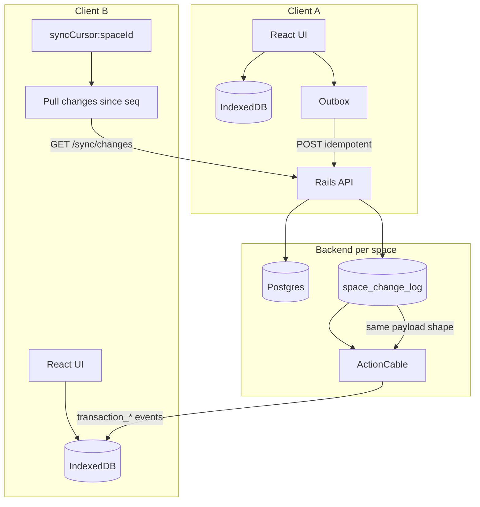

# Per-space change log sync (FIN-196)

Design for making the backend a **sync layer** while IndexedDB remains the runtime source of truth on each client. Complements [OFFLINE_INDEXEDDB_SPIKE.md](./OFFLINE_INDEXEDDB_SPIKE.md) (FIN-194 / FIN-195).

## Status

**Proposal** — not implemented. Tracks ticket **FIN-196** (*v2 sync pull API*).

## Table of contents

1. [Problem](#problem) · [Decision](#decision) · [Terminology](#terminology) · [Architecture](#architecture)
2. [Write path](#write-path) · [Change log schema](#change-log-schema-backend) · [API + cable shape](#change-record-shape-api--cable)
3. [Read / sync path (frontend)](#read--sync-path-frontend) · [Relationship to existing code](#relationship-to-existing-code)
4. [Migration plan](#migration-plan) · [Retention](#retention-and-compaction) · [Conflict policy](#conflict-policy)
5. [Decisions (resolved)](#decisions-resolved)
6. [Backfill](#backfill-existing-spaces) · [Eventual consistency](#eventual-consistency-when-cable-fails) · [Multi-tab](#multi-tab-depends-on-3) · [Every change is a log](#every-change-is-a-log-5)
7. [Appendix A — Rails DDL](#appendix-a--rails-migration-ddl) · [B — Backend modules](#appendix-b--backend-modules) · [C — JSON schemas](#appendix-c--json-schemas) · [D — Frontend modules](#appendix-d--frontend-module-breakdown)
8. [Appendix E — Op catalog](#appendix-e--operation-catalog) · [F — Phase 1 runbook](#appendix-f--phase-1-implementation-runbook) · [G — Sync coordinator](#appendix-g--sync-coordinator) · [H — Import / bulk logging](#appendix-h--import-and-bulk-mutations)
9. [Long offline gap](#long-offline-gap-ttl-scenario) · [Bootstrap sync](#bootstrap-sync-today-vs-v2)

---

## Problem

Today the app is **hybrid**, not fully local-first when online:

| Layer | Current behavior |
|-------|------------------|
| **Client outbox** | Local IndexedDB queue; drains to `POST`/`DELETE` on reconnect |
| **Peer updates (live)** | ActionCable `TransactionsChannel` → upsert/remove in IndexedDB |
| **Peer updates (offline gap)** | No replayable log — catch-up via re-fetching transaction **pages** (current month) or full bootstrap when `OFFLINE_SYNC_VERSION` bumps |
| **Reads (online)** | IndexedDB placeholder, then **server refetch** on mount/focus |

Gaps:

1. ActionCable events are **ephemeral** — a device that was offline misses them.
2. There is **no per-space cursor** (`syncCursor:${spaceId}` is typed in `local-db/types.ts` but unused).
3. Catch-up uses **full snapshots** (paginated list endpoints), not an incremental change feed.
4. Wall-clock timestamps are not a safe versioning primitive for sync.

---

## Decision

Adopt a **hybrid sync model per space**:

1. **Bootstrap** — one-time (or rare) full snapshot into IndexedDB.
2. **Write path** — client local-first + outbox → server applies → append **canonical change record**.
3. **Live path** — ActionCable broadcasts the **same change record shape** as the pull API.
4. **Catch-up path** — `GET …/sync/changes?since=<seq>` per space when a device reconnects or periodically while online.

**Do not** replicate the client outbox on the backend for peer distribution. Peers consume **server-normalized change records**, not raw client command payloads.

---

## Terminology

| Term | Owner | Purpose |
|------|-------|---------|
| **Client outbox** | Frontend (IndexedDB `outbox` table) | Reliable **push** of this device's pending writes |
| **Client mutation id** | Frontend → Backend | Idempotent create (`sync_client_mutations`); maps `local:{uuid}` → server id on source device only |
| **Change log** | Backend (new table) | Append-only, per-space journal of **what the server applied** |
| **Sync cursor** | Frontend (IndexedDB `meta`) | Last applied `seq` per `spaceId` |
| **Snapshot** | Backend pull endpoints | Full or paginated state for bootstrap / repair |

---

## Architecture



### Per-space isolation

Every user may belong to multiple workspaces. Sync is **independent per `space_id`**:

- One **change sequence** per space (monotonic `seq`).
- One **pull cursor** per space in client meta: `syncCursor:${spaceId}` → `{ lastPulledSeq: number }` (advanced by pull only; see [Eventual consistency](#eventual-consistency-when-cable-fails)).
- One ActionCable stream per space: `transactions:{spaceId}` (already exists).
- Bootstrap, outbox drain, and catch-up run **once per space** the user can access.

---

## Write path

Sequence for a local-first create (income / expense / transfer):

```
1. Client A: optimistic write → IndexedDB + React Query
2. Client A: enqueue outbox { commandType, payload, clientMutationId }
3. Client A (online or on reconnect): POST /transactions (+ clientMutationId)
4. Backend:
   a. Idempotency check (sync_client_mutations)
   b. Apply business logic (series, fees, balances, …)
   c. COMMIT to Postgres
   d. INSERT space_change_log row(s) with next seq
   e. Broadcast via ActionCable (same record(s) as log)
5. Client A: replace local:{clientMutationId} → server id; remove outbox row
6. Client B (online): apply change from cable → IndexedDB + React Query
7. Client B (was offline): on reconnect, pull changes since cursor → apply → advance cursor
```

### Why peers do not receive the outbox payload

| Client outbox | Change log entry |
|---------------|------------------|
| May contain `local:{uuid}` ids | Always server ids |
| Pre-server validation shape | Post-server canonical index row |
| One user intent | May expand to many rows (series, transfer + fees) |
| Device-specific retry state | Space-wide truth |

The server is the **normalizer**. Distribution always uses the normalized result.

---

## Change log schema (backend)

Proposed table: `space_change_log` (name TBD).

| Column | Type | Notes |
|--------|------|-------|
| `id` | uuid | PK |
| `space_id` | uuid | FK → spaces; partition key |
| `seq` | bigint | Monotonic **per space**; unique `(space_id, seq)` |
| `op` | string | e.g. `transaction.created`, `transaction.updated`, `transaction.deleted` |
| `entity_type` | string | e.g. `Transactions::Transaction` |
| `entity_id` | uuid | Primary entity; may be one of many in `payload` |
| `payload` | jsonb | Same shape ActionCable uses today (index row or array + tombstones) |
| `actor_user_id` | uuid | Optional; for toasts / audit |
| `origin_client_mutation_id` | string | Optional; link back to source outbox for idempotency debugging only |
| `created_at` | timestamptz | Metadata only — **not** the sync cursor |

### Sequence generation

Use a **database sequence per space** or `MAX(seq) + 1` inside the same transaction as the domain write. Requirements:

- Strictly increasing per space.
- Assigned **after** commit decision (same transaction as the mutation).
- Never reused.

**Do not** use `updated_at` alone as the cursor. Clock skew, bulk updates, and deletes make it unreliable.

### Tombstones (deletes)

Deletes must appear in the log explicitly:

```json
{
  "op": "transaction.deleted",
  "payload": {
    "transactions": [
      { "id": "…", "activitableId": "…", "type": "expense", … }
    ]
  }
}
```

Reuse the index hash shape already broadcast by `Transactions::Broadcasts::TransactionChange#deleted` so clients can remove from IndexedDB and React Query without a full snapshot diff.

### Batched ops

Mirror existing broadcast batching:

- `created_many` / `updated_many` → one log entry with `payload.transactions[]`, or multiple entries sharing the same `seq` batch id (pick one style and keep cable + pull identical).

---

## Change record shape (API + cable)

Align pull API entries with current ActionCable messages so `useTransactionsRealtime` handlers become shared **appliers**:

| `op` (log) | Cable `type` (today) | Client action |
|------------|----------------------|---------------|
| `transaction.created` | `transaction_created` | Upsert index row(s) in IDB + RQ |
| `transaction.updated` | `transaction_updated` | Upsert / patch |
| `transaction.deleted` | `transaction_deleted` | Remove by id + dependent caches |

Future ops (same log, same appliers):

- `account.*`, `budget.*`, `loan.*`, `monthly_summary.*`, `space.settings.*`

Start with **transactions** (highest churn); extend the log incrementally.

### Payload: full row vs patch

**Recommendation: full index row** (current serializer output), not field-level patches.

| Full row | Patch |
|----------|-------|
| Matches existing cable + bootstrap | Smaller on wire |
| One applier (`upsertLocalIndexTransaction`) | Requires merge logic per field |
| Easier for series/fee batches | Harder for expanded server-side effects |

Patches can be a later optimization once the log pipeline is stable.

---

## Read / sync path (frontend)

### IndexedDB meta

```ts
// local-db/meta — per space

// Pull cursor: ONLY advanced after a successful pull loop
{
  key: `syncCursor:${spaceId}`,
  value: {
    lastPulledSeq: number,
    lastPulledAt: number,
  },
}

// Optional: dedupe cable + pull applying the same seq
{
  key: `appliedSeqs:${spaceId}`,
  value: number[], // recent seqs, capped (e.g. last 500)
}
```

**Important:** `lastPulledSeq` is **not** the highest seq seen on cable. Cable may apply seq 1850 while `lastPulledSeq` is still 1842 until pull completes. See [Eventual consistency when cable fails](#eventual-consistency-when-cable-fails).

### When to pull

| Trigger | Action |
|---------|--------|
| App launch (online, `offlineSyncReady`) | For each accessible space: pull `since=lastPulledSeq` |
| `online` event | Drain **local** outbox, then pull per space |
| Tab focus (throttled) | Pull per active space (replaces `refreshOnlineLocalCaches` page re-fetch) |
| ActionCable disconnect | Pull active space(s) — repair missed live events |
| Periodic (foreground + online) | Pull every N minutes as safety net |
| After bootstrap | Set `lastPulledSeq` to `latestSeq` from bootstrap response |
| ActionCable message | Apply immediately; **do not** advance `lastPulledSeq` |

### Pull API (sketch)

```
GET /api/v1/spaces/:space_code/sync/changes
  ?since=1842
  &limit=500

Headers: X-Space-Code (existing pattern)
```

Response:

```json
{
  "data": {
    "spaceId": "…",
    "since": 1842,
    "latestSeq": 1850,
    "changes": [
      {
        "seq": 1843,
        "op": "transaction.created",
        "occurredAt": "2026-08-10T08:00:00Z",
        "payload": { "transactions": [ { "id": "…", "amount": 100, … } ] },
        "actor": { "authId": "…", "fullName": "…" }
      }
    ],
    "hasMore": false
  }
}
```

Client loops `since = latestSeq` until `hasMore === false`.

### Bootstrap API (sketch)

First install, `OFFLINE_SYNC_VERSION` bump, or **`410` recovery**:

```
GET /api/v1/spaces/sync/bootstrap/manifest   # v2 — see Bootstrap sync section
GET /api/v1/spaces/sync/bootstrap/chunks/:part
```

Returns bulk chunks + `latestSeq`. Client verifies, commits atomically, sets `lastPulledSeq`.

**v1 fallback:** existing `syncLocalDataFromBackend` (paginated `/transactions`, per-month budgets, N+1 loans) — correct but slow. See [Bootstrap sync: today vs v2](#bootstrap-sync-today-vs-v2).

### Apply pipeline (frontend)

New module (suggested): `src/services/local-sync/apply-change.ts`

```
for each change (from cable OR pull), in any order:
  if seq > 0 and seq in appliedSeqs: skip
  switch change.op:
    transaction.created → upsertLocalIndexTransaction + RQ + monthly summaries
    transaction.updated → applyRealtimeTransactionUpdated (existing)
    transaction.deleted → removeLocalIndexTransactionsByIds (existing)
  record seq in appliedSeqs

after pull loop completes (not after each cable message):
  lastPulledSeq = response.latestSeq
```

Cable handler calls the same `applySpaceChange(change)` after normalizing cable `type` → `op`. Pull advances `lastPulledSeq` only at the end of the loop.

---

## Relationship to existing code

| Existing | Role in new model |
|----------|-------------------|
| `src/lib/local-db/outbox.ts` | Unchanged — **push** queue for this device |
| `sync_client_mutations` | Unchanged — create idempotency |
| `Transactions::Broadcasts::TransactionChange` | Emit log row **then** broadcast (or broadcast from log row) |
| `useTransactionsRealtime.ts` | Thin wrapper → `applyChange` |
| `bootstrap-local-data.ts` | Bootstrap + set cursor; stop using page fetch as catch-up |
| `useSkipCachedNetworkFetch` | Flip to skip network reads when `offlineSyncReady && cursor set` |
| `refreshOnlineLocalCaches` | Replace transaction page pull with `pullChangesSince` |
| `OFFLINE_SYNC_VERSION` | Bump when bootstrap **shape** changes, not for every data change |

---

## Migration plan

### Phase 1 — Log + pull (transactions only)

See [Appendix F — Phase 1 runbook](#appendix-f--phase-1-implementation-runbook) for ordered tasks.

- [ ] BE: `space_change_log` + `space_sync_sequences` (Appendix A)
- [ ] BE: `AppendChangeLog` / `PullChanges` + `SyncController#changes` (Appendix B)
- [ ] BE: Refactor `TransactionChange` → log + `sync_change` cable (Appendix B, E)
- [ ] BE: Mutation audit + import batch logging (Appendix H)
- [ ] FE: `sync-cursor`, `applied-seqs`, `apply-change`, `pull-space-changes` (Appendix D)
- [ ] FE: `sync-coordinator` + cable disconnect + periodic pull (Appendix G)
- [ ] FE: `useTransactionsRealtime` → shared applier
- [ ] E2E: five scenarios in F.3

### Phase 2 — Reads from IndexedDB only

- [ ] FE: `shouldSkipCachedNetworkFetch` → true when synced (not only offline)
- [ ] FE: Remove mount/focus `GET /transactions` for list views
- [ ] FE: Pagination from local all-time index only

### Phase 3 — Bootstrap v2

See [Bootstrap sync: today vs v2](#bootstrap-sync-today-vs-v2).

- [ ] BE: `bootstrap/manifest` + chunk exports from consistent `latestSeq` snapshot
- [ ] BE: Per-chunk `sha256` + `recordCount`; manifest `totals`
- [ ] FE: Staged Tier 0 / 1 / 2 apply; `offlineSyncReady` after Tier 0
- [ ] FE: Two-phase verify → atomic IDB commit; cursor last
- [ ] FE: `410` → v2 bootstrap with v1 fallback
- [ ] BE: Snapshot at trim boundary (long-offline without full re-download)

### Phase 4 — Extend log

- [ ] Accounts, budgets, loans, categories, monthly summaries
- [ ] Optional: compaction / retention policy for old log rows

---

## Retention and compaction

The log cannot grow forever. Options (decide before production):

| Strategy | Pros | Cons |
|----------|------|------|
| **TTL** (e.g. 90 days) | Simple | Devices offline longer than TTL need full bootstrap |
| **Snapshot + trim** | Periodic space snapshot + delete log before snapshot seq | More moving parts |
| **Keep all** | Simplest catch-up | Storage cost |

**Recommendation:** TTL + forced bootstrap when `since` is older than retained window (`410 Gone` + `bootstrapRequired: true`).

### Decision (v1)

| Setting | Value | Rationale |
|---------|-------|-----------|
| **Retention TTL** | **90 days** | Matches typical mobile reconnect; bootstrap is acceptable for longer offline |
| **`appliedSeqs` v1** | **Capped ring buffer** (last 500 seqs per space in IDB meta) | Cheap dedupe; pull replays within window are no-ops |
| **Periodic pull** | **5 minutes** while app foreground + online | Balances battery vs cable-miss recovery; tab-focus pull remains primary |

If a device is offline > 90 days, `410` → **mandatory** full bootstrap for that space. See [Long offline gap](#long-offline-gap-ttl-scenario).

---

## Long offline gap (TTL scenario)

### The problem you described

```
Day 0     You go offline (lastPulledSeq = 1000)
Day 1–10  Peer changes → logged as seq 1001…1050
Day 90    Those log rows expire (90-day TTL)
Day 101   You come online, pull ?since=1000
```

**If the client only incrementally pulls:** days 1–10 are **not** in the log anymore → **gap** in local data.

This is a real failure mode whenever:

- `lastPulledSeq < oldestAvailableSeq` (cursor fell off the retained window), and
- the client does **not** run a full bootstrap.

### What actually holds the data

| Store | Days 1–10 peer changes |
|-------|-------------------------|
| `space_change_log` | **Gone** after TTL |
| **Postgres** | **Still there** (current truth) |
| Client IndexedDB (stale) | Out of date until repaired |

The log is a **delta journal**, not the system of record. Missing log rows does **not** mean missing transactions in Postgres.

### Required client behavior (`410` contract)

When pull returns `410 Gone` or `bootstrapRequired: true`:

```ts
// NON-OPTIONAL — skipping this causes the gap you described
await syncLocalDataFromBackend(api, queryClient, {
  spaceCode,
  startDate: OFFLINE_BOOTSTRAP_START_DATE,
  endDate: OFFLINE_BOOTSTRAP_END_DATE,
});
await setSyncCursor(spaceId, { lastPulledSeq: latestSeqFromBootstrap });
```

After bootstrap, days 1–10 appear in the UI **if those rows still exist in Postgres** (not deleted later). Incremental pull alone cannot repair this.

### Failure modes to test

| Bug | Symptom |
|-----|---------|
| Ignore `410`, continue incremental pull | **Missing days 1–10** — your scenario |
| Partial bootstrap (transactions fail) | Incomplete IDB |
| Bootstrap without preserving pending `local:` outbox rows | Lost optimistic creates |
| Set `lastPulledSeq` before IDB commit completes | Cursor ahead of data → false "synced" |

### v2 improvement: snapshot at trim boundary

Full bootstrap works but is slow (see below). **Snapshot + trim** avoids re-downloading everything for long-offline clients:

```
At TTL trim (per space):
  1. Materialize checkpoint at seq = S (state as of that moment)
  2. Delete log rows with seq <= S
  3. Expose GET /sync/snapshot?atSeq=S (or latest checkpoint)

Client with lastPulledSeq = 1000, oldestAvailableSeq = 5000:
  1. GET snapshot at S=4999  → full state through retained window
  2. GET changes?since=4999    → deltas since checkpoint
  → No missed days 1–10, no full v1 pagination bootstrap
```

| Approach | Long offline (100 days) | Speed |
|----------|-------------------------|-------|
| Incremental pull only | **Data gap** | Fast |
| `410` → v1 bootstrap | Correct | Slow |
| Snapshot at trim + pull | Correct | Medium |

**v1 ships:** `410` → bootstrap (correctness). **v2 adds:** checkpoint snapshot (speed).

---

## Bootstrap sync: today vs v2

### Bootstrap v1 today (what the code does)

Implemented in `src/services/local-sync/bootstrap-local-data.ts`, triggered by `useOfflineSync` on first run or `OFFLINE_SYNC_VERSION` bump.

**Per space**, sequential steps (`syncLocalDataFromBackend`):

| Step | Endpoint pattern | Why it's slow |
|------|------------------|---------------|
| Space context | `GET /spaces/:code` | Single call — fine |
| Accounts | `GET /transactions/accounts` | Single call — fine |
| **Transactions** | `GET /transactions?page=N` in a loop | **Main bottleneck** — up to **100 pages** (`MAX_TRANSACTION_BOOTSTRAP_PAGES`), 25 rows/page, all-time range `2000-01-01` → `2099-12-31` |
| Monthly summaries | `GET /monthly_financial_summaries` | Single call — fine (~60 rows) |
| Dashboard shell | `GET /dashboard` | Single call — fine |
| Dashboard compose | Client-side per month | CPU only |
| **Budgets** | `GET /budgets` **once per month** from first transaction month → today | **N requests** (e.g. 60+ months = 60+ round trips) |
| **Loans** | Paginated list + **`GET /loans/:id` per loan** + payments per loan | **N+1 pattern** |
| Categories | `GET /transactions/categories` | Single call — fine |
| Transfers | Detail fetch per transfer id found in transactions | Variable |
| Exchange rates | Pairs derived from currencies | Multiple calls |

**All workspaces** run in `syncAllWorkspacesLocalData` — multiplied by space count.

```
Total round trips ≈
  spaces × (1 + 1 + transactionPages + 1 + 1 + budgetMonths + loanPages + loanDetails + …)
```

For a space with 2,000 transactions: ~80 transaction pages alone, each hitting Rails + `combined_transactions` view + serialization.

### Why v1 pagination hurts integrity *and* speed

- **Slow:** latency × page count; serial `await` in loops.
- **Cap risk:** stops at 100 pages → **incomplete transaction index** with only a console warn.
- **No atomic snapshot:** pages fetched at different times — peer could mutate between page 47 and 48.
- **No bundle checksum:** client cannot verify completeness before marking sync done.

### Bootstrap v2 goal

**As fast as possible without compromising data integrity:**

1. **One logical snapshot** per bootstrap (single `latestSeq` watermark).
2. **Bulk transport** instead of UI pagination endpoints.
3. **Staged apply** — unblock the app on Tier 0, finish Tier 2 in background.
4. **Atomic commit** on the client — all-or-nothing cursor advance.

### v2 API shape (proposed)

#### Option A — Manifest + chunks (recommended)

```
GET /api/v1/spaces/sync/bootstrap/manifest
→ {
    latestSeq: 1850,
    snapshotId: "uuid",
    generatedAt: "…",
    chunks: [
      { part: "accounts", url: "…", sha256: "…", recordCount: 12 },
      { part: "categories", … },
      { part: "transactions", …, recordCount: 2048, byteSize: 4200000 },
      { part: "monthly_summaries", … },
      { part: "budgets", … },           // ALL months, one chunk
      { part: "loans", … },             // list + embedded payments
    ],
    totals: { transactions: 2048, budgets: 540, loans: 3 }
  }

GET /api/v1/spaces/sync/bootstrap/chunks/:part
→ gzip JSON array OR ndjson stream
```

Server builds all chunks from a **consistent read** (same transaction / `latestSeq`).

#### Option B — Single gzip bundle

One download for smaller spaces; same integrity fields in a wrapper manifest.

### Staged bootstrap (time-to-interactive)

Don't block the offline-ready gate on the full transaction history.

| Tier | Contents | Unblocks | Target time |
|------|----------|----------|-------------|
| **0 — Critical** | Accounts, categories, current-month transactions, monthly summaries (current year), space context | Dashboard, create transaction, current month list | < 3s |
| **1 — Core** | All transactions (bulk chunk), all monthly summaries | Full transaction list, insights | Background |
| **2 — Extended** | Budgets (all months), loans + payments, transfer details, exchange rates | Budgets tab, loan detail offline | Background |

```ts
// User can use app after Tier 0 commits
setOfflineSyncReady(true); // after Tier 0 atomic commit

// Tier 1/2 continue with progress indicator (non-blocking)
void completeBootstrapTiers1And2(spaceId);
```

`offlineSyncReady` means **safe for daily use**, not "every historical row downloaded."

### Integrity guarantees (how we assure correctness)

#### Server

| Guarantee | Mechanism |
|-----------|-----------|
| **Consistent snapshot** | Generate manifest + all chunks inside one DB transaction (or repeatable-read snapshot) at `latestSeq` |
| **Single watermark** | `latestSeq` on manifest = seq at snapshot time; client sets `lastPulledSeq` to this **only after** commit |
| **Verifiable payload** | Per-chunk `sha256` + `recordCount`; manifest `totals` for cross-check |
| **No partial server state** | Chunks are read-only exports; mutations during download get `seq > latestSeq` → caught by pull after bootstrap |

#### Client

| Guarantee | Mechanism |
|-----------|-----------|
| **Two-phase write** | Download all chunks to memory/staging → verify hashes/counts → **one IDB transaction** swap |
| **Preserve local writes** | Re-merge pending `local:` outbox rows **after** server snapshot apply (same as v1 `collectPendingLocalCreateTransactions`) |
| **Drain outbox after** | Push local mutations; server assigns new seqs; pull `since=latestSeq` for anything that landed during bootstrap |
| **Cursor last** | `setSyncCursor` + `markOfflineSyncComplete` only after Tier 0 (or full) commit succeeds |
| **Rollback on failure** | Failed verify → keep previous IDB + previous cursor; retry bootstrap |
| **No 100-page cap** | Bulk chunk includes full count or explicit `truncated: false` flag — bootstrap **fails** if truncated |

```ts
const commitBootstrapBundle = async (bundle: BootstrapBundle) => {
  verifyManifestChecksums(bundle);
  assertCountsMatch(bundle); // e.g. transactions.length === manifest.totals.transactions

  const pending = await collectPendingLocalCreateTransactions(spaceCode);

  await getLocalDb().transaction("rw", [...stores], async () => {
    await applyAccountsChunk(bundle.accounts);
    await applyTransactionsChunk(bundle.transactions); // bulk upsert
    // … other chunks for this tier
  });

  for (const row of pending) {
    await upsertLocalIndexTransaction(spaceCode, row);
  }

  await setSyncCursor(spaceId, {
    lastPulledSeq: bundle.latestSeq,
    lastPulledAt: Date.now(),
  });
};
```

#### After bootstrap: stay consistent

```
bootstrap completes at latestSeq = 1850
→ drain outbox (local writes)
→ pull changes?since=1850 (peer changes during download)
→ subscribe ActionCable
```

### Parallelism (safe)

| Parallel OK | Must be serial |
|-------------|----------------|
| Download chunks 2–5 while applying chunk 1 | IDB commit per tier |
| Multiple spaces on different workers | `lastPulledSeq` advance per space |
| Hash verification while next chunk downloads | Outbox drain before declaring sync complete for **writes** |

### Mapping v1 → v2 migration

| v1 (`bootstrap-local-data.ts`) | v2 |
|--------------------------------|-----|
| `fetchAllTransactionPagesForSpace` loop | `chunks/transactions` single export |
| `for (range of monthRanges) fetchBudgetsPage` | `chunks/budgets` all months |
| Per-loan `fetchLoanById` + payments | `chunks/loans` with embedded payments |
| `markSpaceTransactionIndexComplete` | `manifest.totals.transactions` + bulk apply |
| `refreshOnlineLocalCaches` page re-fetch | `pullSpaceChanges` only |

Keep v1 as fallback when manifest endpoint unavailable (older app on new BE, or feature flag off).

### 410 recovery path (ties TTL + bootstrap together)

```
pull ?since=1000
  → 410 bootstrapRequired
  → GET bootstrap/manifest (v2) OR syncLocalDataFromBackend (v1 fallback)
  → verify + commit
  → lastPulledSeq = manifest.latestSeq
  → pull ?since=latestSeq (catch changes during bootstrap)
```

Days 1–10 peer edits are in the **bootstrap snapshot** (Postgres state), not replayed from expired log rows.

### Acceptance criteria (bootstrap v2)

- [ ] Space with 5k transactions bootstraps Tier 0 in < 3s on median connection
- [ ] Manifest `totals.transactions` === applied IDB count after commit
- [ ] Simulate peer edit during bootstrap → visible after post-bootstrap pull
- [ ] Pending `local:` create survives bootstrap commit
- [ ] `410` after 100-day offline → bootstrap → days 1–10 transactions visible
- [ ] Failed chunk hash → no cursor advance, retry succeeds

---

Unchanged from spike:

- **Online concurrent edit:** `TransactionEditingChannel` presence; server wins on sync.
- **Offline concurrent edit:** Server wins when change log entries are applied in `seq` order.
- **Same device retry:** `clientMutationId` idempotency prevents duplicate creates.

Change log does not require CRDTs for v1 — **last-write-wins at server** is sufficient if all writes go through the API.

---

## What we are not doing

- Replicating client outbox rows to peer devices
- Client-side diff of full snapshots for routine sync
- Using `updated_at` timestamps as the primary cursor
- Replacing Postgres as source of truth — the log is a **derived journal** for distribution

---

## Decisions (resolved)

| # | Topic | Decision |
|---|-------|----------|
| 1 | Batch log entries | One log row per broadcast batch, one `seq` (Appendix B). |
| 2 | Backfill | **Cursor floor + bootstrap** — see [Backfill](#backfill-existing-spaces) below. |
| 3 | Cable vs pull ordering | Cable may apply out of order; **pull cursor** advances only on pull. Cable failures healed by pull. See [Eventual consistency](#eventual-consistency-when-cable-fails). |
| 4 | Multi-tab | Shared pull cursor via `BroadcastChannel`; all tabs apply cable; one tab owns periodic pull. Depends on #3. |
| 5 | All mutation paths | **Every server-side change appends to the log** before (or atomically with) any side effect. No exceptions for admin, import, or jobs. |

---

## Backfill (existing spaces)

When we ship the change log, production spaces already have years of transactions. We do **not** replay all history into `space_change_log`.

### What happens at deploy

```
Deploy cutoff (seq = 1 for each space)
├── space_change_log starts empty; sequence counter at 0
├── First mutation after deploy → seq 1, 2, 3, …
└── All history before deploy → NOT in the log
```

### Client states after deploy

| Client state | What it does |
|--------------|--------------|
| **Never synced** | Full bootstrap (existing flow) → load IDB snapshot → set `lastPulledSeq` to server's `latestSeq` |
| **Already has IDB bootstrap** | Keep local data as-is → set `lastPulledSeq = 0` or omit cursor → first pull returns only post-deploy changes (seq ≥ 1) |
| **Cursor older than retention** | `410 Gone` → forced bootstrap → new `lastPulledSeq` |

### Why not backfill history into the log (option B)

| Backfill all rows | Cursor floor only |
|-------------------|-------------------|
| Millions of synthetic `transaction.created` rows | Zero migration cost |
| Long deploy job per space | Log starts clean at cutoff |
| Same data already in client IDB from bootstrap | Bootstrap remains authority for pre-cutoff state |

**Pre-cutoff state** = bootstrap snapshot. **Post-cutoff deltas** = change log + pull.

### `oldestAvailableSeq`

The pull API exposes the minimum `seq` still retained (after TTL). If `lastPulledSeq < oldestAvailableSeq`, the client cannot incrementally catch up and must bootstrap.

### First pull after upgrade (existing user)

```
1. User already has offline-ready IDB from FIN-194 bootstrap
2. App upgrade ships change-log sync
3. lastPulledSeq = 0 (or unset → treat as 0)
4. GET /sync/changes?since=0 → only changes since deploy (not full history)
5. Local transaction list still correct (from bootstrap); new peer edits arrive via pull + cable
```

No user-visible re-sync unless `OFFLINE_SYNC_VERSION` bumps bootstrap shape or retention forces `410`.

---

## Eventual consistency when cable fails

ActionCable is a **latency optimization**. The **change log + pull API** is the reliability layer. Postgres remains source of truth; the client is consistent when `lastPulledSeq` catches `latestSeq` on the server (modulo in-flight cable applies).

### Two cursors (do not conflate)

| Cursor | Updated by | Purpose |
|--------|------------|---------|
| **`lastPulledSeq`** | Successful pull loop only | `GET …/changes?since=` — authoritative gap repair |
| **`appliedSeqs`** (or idempotent upsert) | Cable + pull on each applied row | Avoid double-applying the same `seq` |

**Do not** advance `lastPulledSeq` when cable delivers a high seq. That would skip gaps on the next pull.

### Out-of-order delivery (your scenario)

Cable may deliver **1850** before **1843–1849**. That is fine:

```
1. Cable: apply seq 1850 → IDB updated (idempotent upsert)
2. Pull: since=1842 → returns 1843…1850 (including already-applied 1850)
3. Apply each row; skip only if seq already in appliedSeqs
4. End of pull: lastPulledSeq = server latestSeq (e.g. 1850)
5. Cable later: delivers 1847 → apply (not skipped — 1847 not in appliedSeqs yet)
```

Late seqs are applied by **whichever path delivers them first** (cable or pull). Pull does not skip low seqs because a higher seq arrived early on cable.

### When cable fails entirely

Cable can fail silently (offline, WebSocket drop, missed message, app backgrounded). Recovery:

| Mechanism | When | What |
|-----------|------|------|
| **Pull on `online`** | Device reconnects | `since=lastPulledSeq` → all missed rows |
| **Pull on tab focus** | Throttled (e.g. 30s) | Same |
| **Pull on app launch** | Each cold start while online | Same |
| **Pull on cable disconnect** | `consumer.connection.disconnected` | Immediate catch-up pull |
| **Periodic pull** | e.g. every 5 min while app foreground + online | Safety net |
| **Gap detect (optional)** | Applied seq N but never saw N−1 for long | Force immediate pull |

```mermaid
sequenceDiagram
  participant S as Server log
  participant C as Cable
  participant P as Pull API
  participant IDB as Client IDB

  Note over S,IDB: Cable misses 1843-1849
  C->>IDB: seq 1850 (only message received)
  Note over IDB: Apply 1850; lastPulledSeq still 1842

  P->>S: GET changes?since=1842
  S->>P: 1843…1850
  P->>IDB: Apply each (1843-1849 new; 1850 deduped)
  Note over IDB: lastPulledSeq = 1850

  Note over S,IDB: Client now matches server for retained log
```

### Invariants

1. **Log row written in same DB transaction as domain mutation** — if it's in Postgres, it's in the log.
2. **Pull is complete** — client loops until `hasMore: false`, then sets `lastPulledSeq = latestSeq`.
3. **Apply is idempotent** — same `seq` or same entity state can be applied from cable and pull without corruption.
4. **Cable is optional** — app must be correct with pull only (cable just reduces lag).

### `appliedSeqs` storage (decided)

**v1:** `meta` key `` `appliedSeqs:${spaceId}` `` — capped ring buffer of the last **500** seq numbers. Skip apply when `seq` is in the set.

- Pull cursor (`lastPulledSeq`) is independent — never derived from `appliedSeqs`.
- Seq older than the ring window may be re-applied from pull; upsert/delete appliers must be idempotent.
- Implementation: [Appendix G — `applied-seqs.ts`](#applied-seqsts)

---

## Multi-tab (depends on #3)

Because `lastPulledSeq` is pull-owned and cable does not advance it, tabs must coordinate pulls — not cable applies.

| Concern | Approach |
|---------|----------|
| Duplicate pulls | **Leader election**: first tab to acquire `navigator.locks.request("fintr-sync-pull:${spaceId}")` runs pull; others skip |
| Cursor visibility | **`BroadcastChannel("fintr-sync:${spaceId}")`** broadcasts `{ lastPulledSeq, latestSeq }` after each successful pull |
| Cable in every tab | Each tab subscribes to ActionCable (today's behavior); all call `applySpaceChange` with dedupe via `appliedSeqs` |
| Secondary tab UI | On channel message, invalidate local RQ or apply in place (same as today) |

Phase 1 (single tab / mobile WebView): leader lock optional — duplicate pulls are wasteful but safe if apply is idempotent.

Phase 2 (desktop multi-tab): `navigator.locks` + `BroadcastChannel`.

---

## Every change is a log (#5)

**Rule:** no domain mutation reaches peers without a `space_change_log` row. ActionCable emits **from the log entry**, not from ad-hoc serialization.

### Central dispatcher

```ruby
# All write paths call this (or a domain wrapper):
Sync::Operations::AppendChangeLog.new.call(...)
# then broadcast, then jobs, etc.
```

### Paths that must use it

| Path | Today | Required |
|------|-------|----------|
| API create/update/delete transaction | Broadcast direct | Append + broadcast |
| Transfer + fee expansion | `created_many` broadcast | One log row per batch |
| Admin tools | May bypass broadcast | Must append |
| CSV import | Bulk insert | One log row per batch or per N rows |
| Background jobs (balance recalc) | N/A if read-only | Log only if user-visible data changes |
| Monthly summary recompute | Derived | Log `monthly_summary.updated` if clients cache summaries |

### Enforcement

- **Code review checklist** — any `Transaction.create`-class path in operations layer
- **RuboCop / custom cop (later)** — flag `ActionCable.server.broadcast` on `transactions:*` outside `TransactionChange`
- **Spec shared example** — `"appends to space_change_log"` for mutation operations

Import and admin are the usual leak points; treat them as first-class sync producers, not exceptions.

---

## Open questions (remaining)

_All previously blocking questions resolved. Tunables above are v1 defaults; adjust after dogfooding._

---

## Appendix A — Rails migration DDL

Two tables: a **per-space sequence counter** (safe concurrent inserts) and the **append-only log**.

```ruby
# db/migrate/TIMESTAMP_create_space_sync_tables.rb
# frozen_string_literal: true

class CreateSpaceSyncTables < ActiveRecord::Migration[8.1]
  def change
    create_table :space_sync_sequences, id: :uuid, default: -> { "gen_random_uuid()" } do |t|
      t.uuid :space_id, null: false
      t.bigint :last_seq, null: false, default: 0
      t.timestamps
    end

    add_index :space_sync_sequences, :space_id, unique: true
    add_foreign_key :space_sync_sequences, :spaces

    create_table :space_change_log, id: :uuid, default: -> { "gen_random_uuid()" } do |t|
      t.uuid :space_id, null: false
      t.bigint :seq, null: false
      t.string :op, null: false
      t.string :entity_type
      t.uuid :entity_id
      t.jsonb :payload, null: false, default: {}
      t.uuid :actor_user_id
      t.string :origin_client_mutation_id
      t.timestamps null: false
    end

    add_index :space_change_log,
              [ :space_id, :seq ],
              unique: true,
              name: "index_space_change_log_on_space_id_and_seq"
    add_index :space_change_log,
              [ :space_id, :created_at ],
              name: "index_space_change_log_on_space_id_and_created_at"
    add_index :space_change_log, :entity_id
    add_foreign_key :space_change_log, :spaces
    add_foreign_key :space_change_log, :users, column: :actor_user_id
  end
end
```

### Sequence allocation (same transaction as domain write)

```ruby
# app/operations/sync/operations/allocate_space_seq.rb
module Sync
  module Operations
    class AllocateSpaceSeq < Dry::Operation
      def call(space_id:)
        seq = nil

        ActiveRecord::Base.transaction do
          counter = Sync::SpaceSequence.lock.find_or_create_by!(space_id:) do |row|
            row.last_seq = 0
          end

          counter.increment!(:last_seq)
          seq = counter.last_seq
        end

        Success(seq)
      end
    end
  end
end
```

`increment!` on a locked row avoids `MAX(seq) + 1` races under concurrent writers in the same space.

### Retention migration (later)

```ruby
# Partial index for TTL sweeps (optional)
add_index :space_change_log,
          :created_at,
          where: "created_at < NOW() - INTERVAL '90 days'",
          name: "index_space_change_log_stale"
```

---

## Appendix B — Backend modules

### File layout

```
apps/fintr-be/
  app/
    models/sync/
      space_sequence.rb          # space_sync_sequences
      change_log_entry.rb        # space_change_log
    operations/sync/operations/
      allocate_space_seq.rb
      append_change_log.rb       # allocate seq + insert row
      pull_changes.rb            # since/limit query + retention check
    operations/transactions/broadcasts/
      transaction_change.rb      # refactor: append log, then cable from log row
    controllers/api/v1/spaces/
      sync_controller.rb         # changes, bootstrap (v2)
    serializers/sync/serializers/
      change_log_entry_serializer.rb
  spec/
    operations/sync/operations/pull_changes_spec.rb
    requests/api/v1/spaces/sync_spec.rb
```

### Routes

```ruby
# config/routes.rb (under resources :spaces)
namespace :sync do
  get :changes, to: "sync#changes"
  get :bootstrap, to: "sync#bootstrap"
end
```

Effective paths (with existing `X-Space-Code` header pattern):

- `GET /api/v1/spaces/sync/changes?since=0&limit=500`
- `GET /api/v1/spaces/sync/bootstrap`

### `AppendChangeLog` operation

```ruby
module Sync
  module Operations
    class AppendChangeLog < Dry::Operation
      class Contract < Dry::Validation::Contract
        params do
          required(:space_id).value(:string)
          required(:op).value(:string)
          required(:payload).value(:hash)
          optional(:entity_type).value(:string)
          optional(:entity_id).value(:string)
          optional(:actor_user_id).value(:string)
          optional(:origin_client_mutation_id).value(:string)
        end
      end

      def call(params)
        params = step validate(params:)

        seq = step Sync::Operations::AllocateSpaceSeq.new.call(
          space_id: params[:space_id],
        )

        entry = step persist(params:, seq:)
        Success(entry)
      end

      private

      def validate(params:)
        result = Contract.new.call(**params)
        return Failure(result.errors.to_h) unless result.success?

        Success(result.to_h)
      end

      def persist(params:, seq:)
        entry = Sync::ChangeLogEntry.create!(
          space_id: params[:space_id],
          seq:,
          op: params[:op],
          entity_type: params[:entity_type],
          entity_id: params[:entity_id],
          payload: params[:payload],
          actor_user_id: params[:actor_user_id],
          origin_client_mutation_id: params[:origin_client_mutation_id],
        )
        Success(entry)
      rescue ActiveRecord::RecordInvalid => e
        Failure(message: e.message)
      end
    end
  end
end
```

### Refactor `TransactionChange` broadcast

Today: serialize → ActionCable directly.

Target:

```ruby
def created_many(transactions:, actor: nil, suppress_actor_toast: false)
  payloads = serialize_index_rows(transactions: Array(transactions).compact)
  return if payloads.empty?

  space_id = records.first.space_id

  entry = Sync::Operations::AppendChangeLog.new.call(
    space_id: space_id.to_s,
    op: "transaction.created",
    entity_type: "Transactions::Transaction",
    entity_id: records.first.id.to_s,
    payload: { transactions: payloads },
    actor_user_id: actor&.id,
  )
  return unless entry.success?

  broadcast_change_log_entry(
    entry: entry.value!,
    suppress_actor_toast:,
  )
end
```

Cable message adds `seq` and `op` (snake_case in DB, camelCase over the wire via `LowerCamelKeys`):

```json
{
  "type": "sync_change",
  "seq": 1843,
  "op": "transaction.created",
  "spaceId": "…",
  "payload": { "transactions": [ … ] },
  "actor": { … },
  "suppressActorToast": false,
  "originTabId": "…"
}
```

**Decision:** one `seq` per batch (`created_many` / `updated_many` / multi-delete) — matches one user action, one cable message, one pull row.

### `PullChanges` operation

```ruby
module Sync
  module Operations
    class PullChanges < Dry::Operation
      RETENTION_DAYS = 90
      DEFAULT_LIMIT = 500
      MAX_LIMIT = 1_000

      class Contract < Dry::Validation::Contract
        params do
          required(:space_id).value(:string)
          required(:since).value(:integer)
          optional(:limit).value(:integer)
        end
      end

      def call(params)
        params = step validate(params:)
        step check_retention_window(params:)
        step fetch_changes(params:)
      end

      private

      def check_retention_window(params:)
        cutoff = RETENTION_DAYS.days.ago
        oldest = Sync::ChangeLogEntry
          .where(space_id: params[:space_id])
          .order(:seq)
          .limit(1)
          .pick(:created_at)

        if oldest && params[:since].positive? && oldest > cutoff
          # cursor still inside retained window
          return Success(nil)
        end

        if params[:since].positive?
          oldest_seq = Sync::ChangeLogEntry
            .where(space_id: params[:space_id])
            .minimum(:seq) || 0

          if params[:since] < oldest_seq
            return Failure(
              bootstrap_required: true,
              message: "Cursor older than retained change log",
              oldestAvailableSeq: oldest_seq,
            )
          end
        end

        Success(nil)
      end

      def fetch_changes(params:)
        limit = [params[:limit] || DEFAULT_LIMIT, MAX_LIMIT].min

        scope = Sync::ChangeLogEntry
          .where(space_id: params[:space_id])
          .where("seq > ?", params[:since])
          .order(:seq)
          .limit(limit + 1)

        rows = scope.to_a
        has_more = rows.length > limit
        changes = has_more ? rows.first(limit) : rows
        latest_seq = Sync::SpaceSequence.find_by(space_id: params[:space_id])&.last_seq || 0

        Success(
          since: params[:since],
          latestSeq: latest_seq,
          changes:,
          hasMore: has_more,
        )
      end
    end
  end
end
```

### Controller sketch

```ruby
module Api
  module V1
    module Spaces
      class SyncController < Api::V1::ApiController
        def changes
          result = ::Sync::Operations::PullChanges.new.call(
            space_id: current_space.id,
            since: params[:since].to_i,
            limit: params[:limit]&.to_i,
          )

          if result.failure? && result.failure[:bootstrap_required]
            return render_error(
              message: result.failure[:message],
              status: :gone,
              details: {
                bootstrapRequired: true,
                oldestAvailableSeq: result.failure[:oldestAvailableSeq],
              },
            )
          end

          return render_error(message: "Sync failed", status: :unprocessable_content) if result.failure?

          render_success(
            data: ::Sync::Serializers::ChangeLogPullSerializer.render(result.value!),
          )
        end
      end
    end
  end
end
```

### Backfill strategy (existing spaces)

See [Backfill (existing spaces)](#backfill-existing-spaces) for the full narrative.

**Decision:** cursor floor + bootstrap — no historical backfill into the log. Post-deploy changes only in `space_change_log`; pre-deploy state from existing IDB bootstrap.

---

## Appendix C — JSON schemas

All API responses pass through `Transformers::LowerCamelKeys` (snake_case in Ruby, camelCase on the wire). TypeScript types below use **camelCase** as consumed by the frontend.

### `IndexTransaction` (payload row)

Matches `FilteredCombinedSerializer` + `IndexTransaction` in `transactionTypes.ts`:

```ts
// apps/fintr-fe/src/types/syncTypes.ts (proposed)

export type SyncActor = {
  userId: string;
  authId: string;
  fullName: string;
  photoUrl?: string;
};

export type SyncIndexTransaction = {
  id: string;
  date: string;                    // YYYY-MM-DD
  createdAt?: string;              // ISO 8601
  description: string;
  amount: number;
  amountCurrency?: string;
  bookedAmount?: number;
  bookedAmountCurrency?: string;
  categoryName: string;
  subcategoryName?: string | null;
  categoryId?: string;
  subcategoryId?: string | null;
  fromAccountName: string;
  toAccountName: string;
  type:
    | "income"
    | "expense"
    | "transfer"
    | "loan_disbursement"
    | "loan_payment";
  inSeries: boolean;
  hasImage: boolean;
  hasLoanPayment?: boolean;
  calculated?: boolean;
  activitableId?: string;
  isLoanActivity?: boolean;
  loanType?: "borrowed" | "lent";
  loanId?: string;
  entityName?: string;
  tags?: Array<{
    id: string;
    name: string;
    color: string;
    isDefault?: boolean;
    styleImageUrl?: string;
  }>;
};
```

### Transaction payload variants

```ts
export type TransactionChangePayload =
  | { transaction: SyncIndexTransaction }
  | { transactions: SyncIndexTransaction[] };
```

Single-row ops use `transaction`; batch ops (`created_many`, series delete) use `transactions`.

### `SpaceChange` (one log entry)

```ts
export type SpaceChangeOp =
  | "transaction.created"
  | "transaction.updated"
  | "transaction.deleted";
  // Phase 4: | "account.updated" | "budget.updated" | …

export type SpaceChange = {
  seq: number;
  op: SpaceChangeOp;
  occurredAt: string;              // entry.created_at ISO
  payload: TransactionChangePayload;
  actor?: SyncActor;
  originClientMutationId?: string; // debug / support only
  originTabId?: string;            // cable only; omit from pull if noisy
  suppressActorToast?: boolean;    // cable only
};
```

### Pull response

```ts
export type PullChangesResponse = {
  spaceId: string;
  since: number;
  latestSeq: number;
  changes: SpaceChange[];
  hasMore: boolean;
};
```

Example (pretty-printed):

```json
{
  "success": true,
  "message": "Success",
  "data": {
    "spaceId": "a1b2c3d4-…",
    "since": 1842,
    "latestSeq": 1844,
    "hasMore": false,
    "changes": [
      {
        "seq": 1843,
        "op": "transaction.created",
        "occurredAt": "2026-08-10T08:15:32.123Z",
        "payload": {
          "transactions": [
            {
              "id": "f47ac10b-…",
              "date": "2026-08-09",
              "createdAt": "2026-08-09T14:22:01.000Z",
              "description": "Coffee",
              "amount": 5.5,
              "amountCurrency": "PHP",
              "categoryName": "Food",
              "subcategoryName": null,
              "categoryId": "…",
              "fromAccountName": "Cash",
              "toAccountName": "",
              "type": "expense",
              "inSeries": false,
              "hasImage": false,
              "calculated": true,
              "activitableId": "f47ac10b-…"
            }
          ]
        },
        "actor": {
          "userId": "…",
          "authId": "auth0|…",
          "fullName": "Miko",
          "photoUrl": "https://…"
        }
      },
      {
        "seq": 1844,
        "op": "transaction.deleted",
        "occurredAt": "2026-08-10T08:16:01.000Z",
        "payload": {
          "transactions": [
            {
              "id": "9b1deb4d-…",
              "activitableId": "9b1deb4d-…",
              "type": "expense",
              "date": "2026-08-01",
              "description": "Old row",
              "amount": 10,
              "categoryName": "Food",
              "fromAccountName": "Cash",
              "toAccountName": "",
              "inSeries": false,
              "hasImage": false
            }
          ]
        }
      }
    ]
  }
}
```

### Cable message (unified shape)

Wrap legacy `transaction_created` into `sync_change` over time; during migration support both:

```ts
export type CableSyncMessage = {
  type: "sync_change";
  seq: number;
  op: SpaceChangeOp;
  spaceId: string;
  payload: TransactionChangePayload;
  actor?: SyncActor;
  originTabId?: string;
  suppressActorToast?: boolean;
};

// Legacy (until Phase 1 complete):
export type CableLegacyMessage = {
  type: "transaction_created" | "transaction_updated" | "transaction_deleted";
  spaceId: string;
  transaction?: Record<string, unknown>;
  transactions?: Array<Record<string, unknown>>;
  actor?: Record<string, unknown>;
  originTabId?: string;
  suppressActorToast?: boolean;
};
```

Normalizer:

```ts
export const cableMessageToSpaceChange = (
  message: CableSyncMessage | CableLegacyMessage,
): SpaceChange | null => {
  if (message.type === "sync_change") {
    return {
      seq: message.seq,
      op: message.op,
      occurredAt: new Date().toISOString(),
      payload: message.payload,
      actor: message.actor,
      originTabId: message.originTabId,
      suppressActorToast: message.suppressActorToast,
    };
  }

  const opMap = {
    transaction_created: "transaction.created",
    transaction_updated: "transaction.updated",
    transaction_deleted: "transaction.deleted",
  } as const;

  const op = opMap[message.type as keyof typeof opMap];
  if (!op) return null;

  return {
    seq: 0, // legacy: no seq; pull will reconcile
    op,
    occurredAt: new Date().toISOString(),
    payload: message.transactions
      ? { transactions: message.transactions as SyncIndexTransaction[] }
      : { transaction: message.transaction as SyncIndexTransaction },
    actor: message.actor as SyncActor | undefined,
    originTabId: message.originTabId,
    suppressActorToast: message.suppressActorToast,
  };
};
```

### Bootstrap v2 response (sketch)

```ts
export type SyncBootstrapResponse = {
  spaceId: string;
  latestSeq: number;
  accounts: unknown;               // existing accounts list shape
  categories: unknown;
  monthlyFinancialSummaries: unknown;
  transactionPages: TransactionsPage[];
  loans: unknown;
  budgetsByMonth: Record<string, unknown>;
};
```

### Error: bootstrap required

HTTP `410 Gone`:

```json
{
  "success": false,
  "error": {
    "message": "Cursor older than retained change log",
    "details": {
      "bootstrapRequired": true,
      "oldestAvailableSeq": 50000
    }
  }
}
```

Client action: run full bootstrap, set `syncCursor` to `latestSeq`, discard stale cursor.

### Client meta cursor

```ts
export type SpaceSyncCursor = {
  lastPulledSeq: number;   // pull API `since` — never advanced by cable alone
  lastPulledAt: number;
};

export type AppliedSeqsMeta = {
  seqs: number[];          // capped ring buffer for dedupe
};
```

Stored at `meta` keys `` `syncCursor:${spaceId}` `` and `` `appliedSeqs:${spaceId}` ``.

---

## Appendix D — Frontend module breakdown

### Directory layout (new + touched)

```
apps/fintr-fe/src/
  types/
    syncTypes.ts                         # SpaceChange, PullChangesResponse, …

  lib/local-db/
    sync-cursor.ts                       # get/set SpaceSyncCursor per space
    types.ts                             # already has syncCursor: key type

  services/local-sync/
    apply-change.ts                      # single applier for cable + pull
    apply-transaction-change.ts          # op-specific IDB + RQ + summaries
    pull-space-changes.ts                # paginated GET …/sync/changes
    normalize-cable-message.ts           # legacy + sync_change → SpaceChange
    bootstrap-local-data.ts              # + set cursor from latestSeq
    drain-outbox.ts                      # unchanged; runs before pull

  services/local-sync/__tests__/
    apply-change.test.ts
    pull-space-changes.test.ts
    normalize-cable-message.test.ts

  hooks/
    useOfflineSync.ts                    # pull after drain on online/focus
    useTransactionsRealtime.ts           # → normalize + applyChange
    useOfflineReadMode.ts                # skip network when cursor present
    useSpaceSync.ts                      # (optional) per-space pull state

  hooks/async/
    useInfiniteTransactions.ts           # IDB-only reads when synced
```

### Module responsibilities

| Module | Responsibility |
|--------|----------------|
| **`sync-cursor.ts`** | `getSyncCursor`, `setSyncCursor` (`lastPulledSeq` only), `hasSyncCursor` |
| **`pull-space-changes.ts`** | Loop `since=lastPulledSeq` until `!hasMore`; apply each change; set `lastPulledSeq = latestSeq` at end |
| **`apply-change.ts`** | Dedupe via `appliedSeqs`; dispatch by `op`; does **not** advance pull cursor |
| **`apply-transaction-change.ts`** | Thin wrapper reusing `upsertLocalIndexTransaction`, `applyRealtimeTransactionUpdated`, `removeLocalIndexTransactionsByIds`, monthly summary helpers |
| **`normalize-cable-message.ts`** | `cableMessageToSpaceChange`; maps legacy types during rollout |
| **`useTransactionsRealtime.ts`** | Subscribe to channel → normalize → `applyChange` (drop inline switch) |
| **`useOfflineSync.ts`** | On `online` / focus: `drainAllOutboxes` then `pullSpaceChanges` for each accessible space |
| **`useOfflineReadMode.ts`** | `shouldSkipCachedNetworkFetch({ offlineSyncReady, hasSyncCursor })` — not `!isOnline` alone |

### `apply-change.ts` (pseudocode)

```ts
export const applySpaceChange = async (params: {
  spaceId: string;
  change: SpaceChange;
  queryClient: QueryClient;
  source: "cable" | "pull";
}): Promise<void> => {
  const { spaceId, change, queryClient, source } = params;

  if (change.seq > 0 && (await isSeqApplied(spaceId, change.seq))) {
    return; // already applied via cable or prior pull row
  }

  switch (change.op) {
    case "transaction.created":
      await applyTransactionCreated({ spaceId, change, queryClient });
      break;
    case "transaction.updated":
      await applyTransactionUpdated({ spaceId, change, queryClient });
      break;
    case "transaction.deleted":
      await applyTransactionDeleted({ spaceId, change, queryClient });
      break;
    default:
      console.warn("[sync] Unknown op", change.op);
      return;
  }

  if (change.seq > 0) {
    await markSeqApplied(spaceId, change.seq);
  }

  // lastPulledSeq is updated only in pull-space-changes.ts after the loop

  if (source === "cable" && change.actor) {
    maybeNotifyActorToast(change);
  }
};
```

### `pull-space-changes.ts` (pseudocode)

```ts
export const pullSpaceChanges = async (params: {
  api: AxiosInstance;
  spaceId: string;
  queryClient: QueryClient;
}): Promise<void> => {
  const cursor = await getSyncCursor(params.spaceId);
  let since = cursor?.lastPulledSeq ?? 0;

  while (true) {
    const response = await params.api.get("/spaces/sync/changes", {
      params: { since, limit: 500 },
      headers: { "X-Space-Code": params.spaceId },
    });

    const data = response.data.data as PullChangesResponse;

    for (const change of data.changes) {
      await applySpaceChange({
        spaceId: params.spaceId,
        change,
        queryClient: params.queryClient,
        source: "pull",
      });
    }

    since = data.latestSeq;
    if (!data.hasMore) {
      await setSyncCursor(params.spaceId, {
        lastPulledSeq: data.latestSeq,
        lastPulledAt: Date.now(),
      });
      break;
    }
  }
};
```

### Multi-space loop

```ts
// Called from useOfflineSync after drainAllOutboxes
export const pullAllAccessibleSpaces = async (params: {
  api: AxiosInstance;
  queryClient: QueryClient;
  spaceCodes: string[];
}): Promise<void> => {
  for (const spaceCode of params.spaceCodes) {
    try {
      await pullSpaceChanges({
        api: params.api,
        spaceId: spaceCode,
        queryClient: params.queryClient,
      });
    } catch (error) {
      if (isBootstrapRequiredError(error)) {
        await syncLocalDataFromBackend(/* full bootstrap for this space */);
        continue;
      }
      console.warn("[sync] Pull failed for space", spaceCode, error);
    }
  }
};
```

### Cable vs pull ordering

See [Eventual consistency when cable fails](#eventual-consistency-when-cable-fails).

Summary:

1. Cable may deliver **1850** before **1843–1849** — all are applied when they arrive.
2. **`lastPulledSeq`** advances only when a pull loop finishes (`latestSeq` from server).
3. If cable missed **1843–1849**, the next pull (`since=lastPulledSeq`) returns them.
4. **`appliedSeqs`** prevents double-apply when pull replays a row cable already delivered.

### Multi-tab

See [Multi-tab (depends on #3)](#multi-tab-depends-on-3). `navigator.locks` for pull leader; `BroadcastChannel` to share `lastPulledSeq` after pull.

### Tests to add

| Test | Asserts |
|------|---------|
| `apply-change.test.ts` | Dedupe via `appliedSeqs`; out-of-order cable seq still applies; delete removes IDB row |
| `pull-space-changes.test.ts` | Paginates until `hasMore: false`; 410 triggers bootstrap flag |
| `normalize-cable-message.test.ts` | Legacy `transaction_created` maps to `transaction.created` |
| BE `pull_changes_spec.rb` | Retention returns 410; limit cap; ordering by seq |

---

## Appendix E — Operation catalog

All `op` values are lowercase, dot-separated: `<domain>.<verb>`. Payload shapes reuse existing serializers unless noted.

### Phase 1 — Transactions

| `op` | Trigger (BE) | Payload | Client applier |
|------|--------------|---------|----------------|
| `transaction.created` | Create income/expense/transfer/loan payment (single) | `{ transaction }` or `{ transactions }` | `upsertLocalIndexTransaction` + RQ |
| `transaction.updated` | Update transaction, transfer patch, loan payment edit | `{ transaction }` or `{ transactions }` | `applyRealtimeTransactionUpdated` |
| `transaction.deleted` | Delete (any scope), series delete | `{ transactions }` tombstones | `removeLocalIndexTransactionsByIds` |

Batch expansion (repeat series, transfer + fees): **one log row**, `payload.transactions[]`, same as `created_many` / `updated_many` / multi-delete broadcast today.

### Phase 4 — Other domains (planned)

| `op` | Notes |
|------|-------|
| `account.created` / `updated` / `deleted` | Accounts list + detail caches |
| `category.created` / `updated` / `deleted` | Category picker + filters |
| `budget.upserted` / `deleted` | Per-month budget cache keys |
| `loan.created` / `updated` / `deleted` | Loans tab + detail |
| `loan_payment.created` / `deleted` | Loan payment schedules |
| `monthly_summary.updated` | Raw bucket row or month key in payload |
| `space.settings.updated` | Currency change → invalidate rates + summaries |

### Op naming rules

1. Past tense verb (`created`, not `create`).
2. Domain matches FE cache owner (`transaction`, not `income`).
3. Deletes always include enough index fields to remove from IDB without a fetch.
4. One user-visible action → prefer one `seq` (batch children in `transactions[]`).

---

## Appendix F — Phase 1 implementation runbook

Ordered tasks with acceptance criteria. Ship behind a feature flag if needed: `FINTR_SPACE_SYNC_PULL=1`.

### F.1 Backend (fintr-be)

| Step | Task | Done when |
|------|------|-----------|
| 1 | Migration: `space_sync_sequences`, `space_change_log` | `rails db:migrate` clean |
| 2 | Models `Sync::SpaceSequence`, `Sync::ChangeLogEntry` | Validations + `(space_id, seq)` unique |
| 3 | `AllocateSpaceSeq`, `AppendChangeLog`, `PullChanges` operations | Unit specs green |
| 4 | `Api::V1::Spaces::SyncController#changes` | Request spec: pagination, 410, auth, space scope |
| 5 | Refactor `TransactionChange` to append log then broadcast `sync_change` | Create/delete/update specs assert log row count |
| 6 | Audit mutation paths: `CreateTransaction`, `UpdateTransaction`, `DeleteTransaction`, transfers, loan payments | Shared example `appends to space_change_log` |
| 7 | Retention job (cron): delete log rows older than 90 days per space | Job spec; `oldestAvailableSeq` exposed in pull meta |

### F.2 Frontend (fintr-fe)

| Step | Task | Done when |
|------|------|-----------|
| 1 | `types/syncTypes.ts` | Types match Appendix C |
| 2 | `lib/local-db/sync-cursor.ts`, `applied-seqs.ts` | Read/write meta; ring buffer cap 500 |
| 3 | `services/local-sync/apply-change.ts` + `apply-transaction-change.ts` | Reuses existing IDB helpers |
| 4 | `normalize-cable-message.ts` | Legacy + `sync_change` → `SpaceChange` |
| 5 | `pull-space-changes.ts` | Paginates; sets `lastPulledSeq` at end only |
| 6 | `sync-coordinator.ts` (Appendix G) | Wired from `useOfflineSync` |
| 7 | Refactor `useTransactionsRealtime.ts` → `applySpaceChange` | Existing realtime tests pass |
| 8 | Cable disconnect → `schedulePullForSpace` | Manual test: kill WS, create on peer, pull restores |
| 9 | Feature flag gate | Off = legacy refetch; on = pull path |

### F.3 Verification (manual)

1. **Two browsers, same space** — create on A; B sees via cable without refresh.
2. **B offline** — create on A; bring B online; B sees via pull (no full bootstrap).
3. **Cable blocked** — disable WS in DevTools; mutate on A; pull on focus on B restores.
4. **Out-of-order** — simulate by applying high seq before low on B; both rows present after pull settles.
5. **Own outbox** — create offline on A; reconnect; drains then peers see via their pull/cable.

### F.4 Rollout

1. Deploy BE (log writes + pull endpoint; cable still sends legacy types).
2. Deploy FE with flag off.
3. Enable flag for internal spaces / dogfood.
4. Switch cable to `sync_change` with `seq`.
5. Phase 2: flip read gate to IDB-only when cursor present.

---

## Appendix G — Sync coordinator

Single entry point so `useOfflineSync`, cable, and timers do not duplicate pull logic.

### File: `src/services/local-sync/sync-coordinator.ts`

```ts
type SyncCoordinatorOptions = {
  api: AxiosInstance;
  queryClient: QueryClient;
  spaceCodes: string[];
};

const PULL_THROTTLE_MS = 30_000;
const PERIODIC_PULL_MS = 5 * 60_000;

const lastPullAtBySpace = new Map<string, number>();
let periodicTimer: ReturnType<typeof setInterval> | null = null;

export const schedulePullForSpace = async (
  opts: SyncCoordinatorOptions,
  spaceId: string,
  reason: "online" | "focus" | "cable_disconnect" | "periodic" | "launch",
): Promise<void> => {
  if (typeof navigator !== "undefined" && navigator.onLine === false) {
    return;
  }

  const throttleMs = reason === "cable_disconnect" ? 0 : PULL_THROTTLE_MS;
  const last = lastPullAtBySpace.get(spaceId) ?? 0;
  if (Date.now() - last < throttleMs) {
    return;
  }

  const acquired = await tryAcquirePullLock(spaceId);
  if (!acquired) {
    return;
  }

  try {
    await drainAllOutboxes({ api: opts.api, spaceIds: [spaceId] });
    await pullSpaceChanges({
      api: opts.api,
      spaceId,
      queryClient: opts.queryClient,
    });
    lastPullAtBySpace.set(spaceId, Date.now());
    broadcastPullComplete(spaceId);
  } finally {
    await releasePullLock(spaceId);
  }
};

export const schedulePullAllSpaces = async (
  opts: SyncCoordinatorOptions,
  reason: SyncCoordinatorOptions extends never ? never : Parameters<typeof schedulePullForSpace>[2],
): Promise<void> => {
  for (const spaceId of opts.spaceCodes) {
    await schedulePullForSpace(opts, spaceId, reason);
  }
};

export const startPeriodicPull = (opts: SyncCoordinatorOptions): void => {
  stopPeriodicPull();
  periodicTimer = setInterval(() => {
    if (document.visibilityState !== "visible") {
      return;
    }
    void schedulePullAllSpaces(opts, "periodic");
  }, PERIODIC_PULL_MS);
};

export const stopPeriodicPull = (): void => {
  if (periodicTimer) {
    clearInterval(periodicTimer);
    periodicTimer = null;
  }
};
```

### Pull lock (multi-tab)

```ts
const tryAcquirePullLock = async (spaceId: string): Promise<boolean> => {
  if (typeof navigator === "undefined" || !navigator.locks) {
    return true;
  }

  // Non-blocking: skip if another tab holds the lock
  const controller = new AbortController();
  const lockPromise = navigator.locks.request(
    `fintr-sync-pull:${spaceId}`,
    { signal: controller.signal },
    async () => {
      await new Promise(() => {}); // held until release
    },
  );

  await new Promise((r) => setTimeout(r, 0));
  controller.abort();

  try {
    await lockPromise;
    return false;
  } catch {
    return true;
  }
};
```

Simpler v1 alternative: always pull; rely on `appliedSeqs` dedupe (wasteful but correct).

### BroadcastChannel

```ts
const CHANNEL = "fintr-sync";

export const broadcastPullComplete = (spaceId: string): void => {
  if (typeof BroadcastChannel === "undefined") return;
  const cursor = /* read syncCursor async or pass in */;
  new BroadcastChannel(CHANNEL).postMessage({
    type: "pull_complete",
    spaceId,
    lastPulledSeq: cursor.lastPulledSeq,
  });
};

export const subscribeSyncBroadcast = (
  onPullComplete: (spaceId: string, lastPulledSeq: number) => void,
): (() => void) => {
  if (typeof BroadcastChannel === "undefined") {
    return () => {};
  }
  const channel = new BroadcastChannel(CHANNEL);
  channel.onmessage = (event) => {
    if (event.data?.type === "pull_complete") {
      onPullComplete(event.data.spaceId, event.data.lastPulledSeq);
    }
  };
  return () => channel.close();
};
```

Secondary tabs update local `lastPulledSeq` from broadcast so they do not immediately re-pull.

### Cable disconnect wiring

In `useTransactionsRealtime.ts` (or a thin `useSyncCableLifecycle.ts`):

```ts
useEffect(() => {
  const consumer = getConsumer();
  if (!consumer?.connection) return;

  const handleDisconnect = () => {
    void schedulePullForSpace(
      { api, queryClient, spaceCodes: [spaceId] },
      spaceId,
      "cable_disconnect",
    );
  };

  consumer.connection.monitor.reconnectAttempt = /* preserve existing */;
  // ActionCable: subscribe to connection events via wrapper in lib/actionCable.ts
  return subscribeToCableDisconnect(handleDisconnect);
}, [spaceId, api, queryClient]);
```

### Hook: `useSpaceSync.ts`

```ts
export const useSpaceSync = (spaceCode: string) => {
  const { api } = useAuthApi({ scope: "…" });
  const queryClient = useQueryClient();
  const spaceCodes = useAccessibleSpaceCodes(); // from spaces list cache

  useEffect(() => {
    if (!spaceCode || !api) return;

    const opts = { api, queryClient, spaceCodes };

    void schedulePullForSpace(opts, spaceCode, "launch");
    startPeriodicPull(opts);

    const unsubBroadcast = subscribeSyncBroadcast((id, seq) => {
      if (id === spaceCode) {
        void setSyncCursor(id, { lastPulledSeq: seq, lastPulledAt: Date.now() });
      }
    });

    return () => {
      stopPeriodicPull();
      unsubBroadcast();
    };
  }, [spaceCode, api, queryClient, spaceCodes]);
};
```

Call from private layout alongside `useOfflineSync` once bootstrap has set initial cursor.

### `applied-seqs.ts`

```ts
const MAX_APPLIED_SEQS = 500;

export const isSeqApplied = async (
  spaceId: string,
  seq: number,
): Promise<boolean> => {
  const meta = await getAppliedSeqsMeta(spaceId);
  return meta.seqs.includes(seq);
};

export const markSeqApplied = async (
  spaceId: string,
  seq: number,
): Promise<void> => {
  const meta = await getAppliedSeqsMeta(spaceId);
  const next = [...meta.seqs.filter((s) => s !== seq), seq];
  while (next.length > MAX_APPLIED_SEQS) {
    next.shift();
  }
  await putAppliedSeqsMeta(spaceId, { seqs: next });
};
```

If pull returns a seq outside the ring (older than 500 behind), apply anyway — upsert is idempotent; ring only optimizes hot path.

---

## Appendix H — Import and bulk mutations

Imports can create thousands of rows. **One log row per batch**, not per row.

### Pattern

```ruby
module Imports
  module Operations
    class CommitImportBatch < Dry::Operation
      BATCH_SIZE = 100

      def call(params)
        transactions = step create_transactions(params:)
        step append_import_change_log(transactions:)
        step broadcast_import_batch(transactions:)
        Success(transactions)
      end

      def append_import_change_log(transactions:)
        payloads = Transactions::Broadcasts::TransactionChange
          .serialize_index_rows(transactions:)

        Sync::Operations::AppendChangeLog.new.call(
          space_id: transactions.first.space_id.to_s,
          op: "transaction.created",
          entity_type: "Transactions::Transaction",
          entity_id: transactions.first.id.to_s,
          payload: { transactions: payloads },
          actor_user_id: Current.user&.id,
        )
      end
    end
  end
end
```

### Rules for bulk

| Rule | Why |
|------|-----|
| Max **100–250** transactions per log row | Pull page size friendly; cable message size |
| One `seq` per batch | Client applies batch atomically in one IDB transaction |
| Import completion may emit **`import.completed`** meta op (optional) | UI progress only; not required for IDB |
| Admin mass-delete | `transaction.deleted` with `transactions[]` tombstones, batched |

### Client apply for batch

```ts
case "transaction.created":
  await db.transaction("rw", db.transactions, async () => {
    for (const row of payload.transactions ?? [payload.transaction]) {
      await upsertLocalIndexTransaction(spaceId, row);
    }
  });
  upsertIndexTransactionsIntoQueryCaches(queryClient, { spaceId, transactions });
  break;
```

---

## Comparison summary

| Approach | Verdict |
|----------|---------|
| Client outbox → server DB → **change log** → peers | **Target** |
| Client outbox → peers directly | **Reject** — not canonical |
| Full snapshot on every reconnect | **Reject** for routine sync — bootstrap / repair only |
| Timestamp-based “what changed” | **Avoid** as primary cursor — use `seq` |
| ActionCable alone | **Insufficient** — needs persistent log for offline gaps |

---

## References

- [OFFLINE_INDEXEDDB_SPIKE.md](./OFFLINE_INDEXEDDB_SPIKE.md) — current IndexedDB + outbox implementation
- `apps/fintr-be/app/operations/transactions/broadcasts/transaction_change.rb` — cable payload shape to reuse
- `apps/fintr-be/app/models/sync/client_mutation.rb` — write idempotency
- `apps/fintr-fe/src/hooks/useTransactionsRealtime.ts` — live applier to unify with pull
- `apps/fintr-fe/src/lib/local-db/types.ts` — `syncCursor:${string}` placeholder
