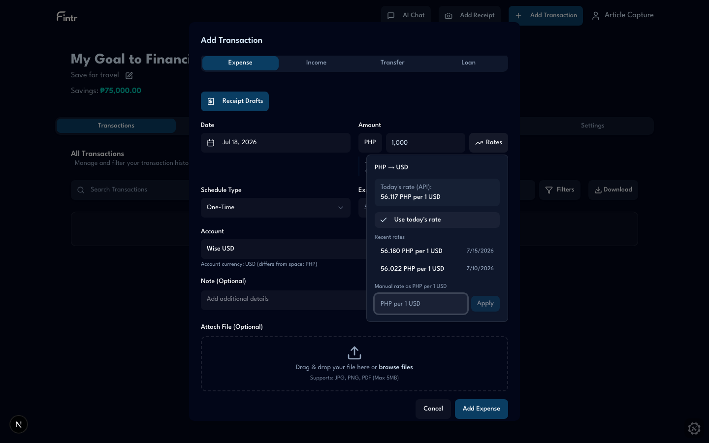

# Multi-Currency Done Right: How Fintr Handles Exchange Rates (And Why It Matters)

*If you've ever tried to budget in pesos while spending in dollars — or track a USD savings account inside a PHP household budget — you already know the problem. Most personal finance apps weren't built for you.*

---

## The problem nobody talks about

Managing money across currencies sounds simple until you actually do it.

You earn in one currency. You spend in another. Your bank account is denominated in a third. Your partner thinks in a fourth. And every time you log a transaction, you're not just recording an amount — you're making a bet on an exchange rate that may not match what your bank actually charged.

The stakes are higher than a rounding error. Get FX wrong and your account balances drift. Delete a transaction and the reversal doesn't match what you originally booked. Your monthly totals silently mix USD numerals into a PHP summary. Your net worth looks $20,000 when half of that is actually Canadian dollars.

This is the gap Fintr was built to close.

---

## Three currencies, one clear mental model

Most apps collapse everything into a single "budget currency" and hope for the best. Fintr separates concerns into three layers:

| Layer | What it is | Example |
|-------|-----------|---------|
| **Household currency** | Your household's default display and input context | PHP |
| **Account currency** | The ledger currency each account actually holds | USD on a Wise account |
| **Transaction amount** | The booked amount, frozen at the rate you accepted | $17.82 debited from the USD account |

When you enter **₱1,000** on an expense against a USD account, Fintr doesn't just divide by today's rate and move on. It stores:

- The **original amount** you typed (₱1,000)
- The **converted amount** booked to the account ($17.82)
- The **exchange rate** derived from those two numbers
- The **source** of that rate — auto, manual, or recent

That last point matters more than it sounds. The rate isn't a floating suggestion. It's a contract between what you entered and what hit your ledger.

---

## The intricacies that separate good FX from broken FX

### 1. Booked rates don't drift

Here's a subtle bug that plagues multi-currency apps: you record a transaction at one rate, then delete or reverse it at today's rate. Your balance is now wrong — and you have no idea why.

Fintr solves this with **rate immutability**. Once a transaction is booked with a currency conversion, Fintr locks in the amount that hit your account. If you delete, edit, or undo that transaction later, it always uses that same booked amount — never today's exchange rate. Your balance stays consistent because the math matches what actually happened.

This is the kind of correctness you only notice when it's missing — but it's exactly what keeps your accounts trustworthy over time.

### 2. Display and storage are deliberately different

What you see and what the ledger stores serve different purposes.

- **What gets saved**: Fintr records the amount that actually hit your account, plus a full conversion history — what you originally entered, what was converted, which rate was used, and whether you picked it automatically, manually, or from your recent history.
- **What you see**: The app shows amounts in your household's currency for summaries, but still respects what you typed. If you entered ₱1,000 in a PHP household against a USD account, the list shows **₱1,000** — not a mislabeled $17.82 with a peso symbol.

This "original in household currency" edge case is exactly where simpler apps break. Fintr treats it as a first-class scenario, not an afterthought.

### 3. Historical rates, not just today's rate

Exchange rates aren't static. A transaction from March 15 should use March 15's rate — not whatever the market is doing when you open the app six months later.

When you log a transaction, Fintr looks up the rate for **that specific date** — not just today. So a purchase from March 15 uses March 15's rate, even if you're entering it months later. Fintr supports roughly 340 currencies and keeps rates updated daily, fetching any missing pairs on the fly so you're never stuck waiting.

### 4. Three ways to set a rate

Not every conversion should be left to the API. Fintr gives you three rate sources:

| Source | When to use it |
|--------|---------------|
| **Auto** | Default — today's (or historical) API rate |
| **Manual** | You know the exact rate your bank charged |
| **Recent** | Reuse a rate from your own transaction history in your household |

The "recent rates" feature is particularly thoughtful. Instead of showing global market data, Fintr surfaces the **last three rates you've actually used** for a given currency pair in your household — pulled from your own transactions and transfers. If you always convert PHP→USD through GCash at a specific spread, your history remembers.

### 5. Totals that refuse to lie

Aggregating multi-currency data is where apps get dangerous. Fintr takes a strict approach to monthly totals: if a transaction can't be properly converted to your household currency, it won't be silently counted as if the numbers were already in pesos. Your expense summary for the month is either correctly converted or honestly excluded — never silently wrong.

Individual transactions in your list are still shown in a useful way, but the totals hold the line.

### 6. Cross-currency transfers

Multi-currency isn't just about expenses. Fintr applies the same conversion machinery to **transfers** between accounts in different currencies, with the same persistence, audit trail, and balance integrity guarantees.

### 7. Your currency choice survives account changes

A small UX detail that reveals deep product thinking: when you pick AED and enter 2,000, then switch the target account from an AED account to a USD account, **your entered currency and amount stay put**. Fintr converts at the rate you chose — it doesn't silently reset your input to the new account's currency.

This sounds obvious. It isn't. Most forms reset the currency dropdown when you change accounts, forcing you to re-enter everything.

---

## Why most apps struggle with multi-currency

Not every budgeting app handles foreign exchange badly — but many were designed for households that earn, spend, and save in a single currency. When your life doesn't fit that model, the gaps show up fast.

### Single-currency by design

Some popular budgeting apps only support **one currency per budget**. The usual workaround is maintaining separate budgets for each currency and manually recording transfers between them. That works, but it splits your financial picture across multiple plans instead of one household view.

### No real conversion at all

Other apps display a currency symbol but **don't actually convert behind the scenes**. A balance of 10,000 Japanese yen can show up looking like $10,000. Mix accounts in different currencies and your net worth total treats them as if they were the same — which can be badly misleading.

### Plugins and workarounds

Where native support is missing, third-party plugins, browser extensions, and sidecar tools often fill the gap. They can scan receipts, look up historical rates, and push converted amounts back into your main app — sometimes storing the original amount and rate in a transaction note rather than as structured data. Useful, but it's a patch on top of a single-currency foundation.

### Partial support

A smaller set of apps do offer multi-currency features — daily rate updates, base-currency net worth, multi-currency budgets. Even then, limitations often remain: budgets that convert at today's rate instead of the transaction date, no support for cross-currency transfer budgets, or foreign transactions imported into the wrong currency on a single account.

### What Fintr does differently

Fintr was built for multi-currency households from the start:

- **One unified view** — no separate budgets per currency, no plugins required
- **Real conversion** — every account has its own currency; totals use actual exchange rates
- **Locked rates per transaction** — the rate you book is the rate your balance honors
- **Full conversion history** — what you entered, what was booked, which rate was used, and how you chose it
- **Honest totals** — monthly summaries don't silently mix currencies

---

## What this looks like in practice

### Logging an overseas purchase

You're in Tokyo. Your household budget is in PHP. Your credit card account is in USD.

1. Open the expense form, enter **¥5,000**
2. Select JPY as the transaction currency
3. Pick your USD credit card account
4. Fintr fetches the rate for today's date (or lets you pick a recent rate you've used before, or enter the rate your bank actually charged)
5. You see a live preview: **¥5,000 → $33.12**
6. Save. The USD account is debited $33.12. The conversion record stores ¥5,000, $33.12, the rate, and the source.

Later, your transaction list shows the expense in PHP equivalent for your household view. Toggle "show currencies" and you see the original ¥5,000.

### Checking your household net worth

Your household has three accounts: PHP savings (₱500,000), USD Wise ($12,000), and AED travel wallet (AED 3,000).

The account list shows each balance in its native currency. The total at the bottom converts everything to PHP using today's rates. Tap a non-PHP amount and you see the PHP equivalent inline.

### Budgeting with mixed currencies

Because your household currency drives summaries and insights, your monthly spending totals, budget comparisons, and financial summaries all aggregate in PHP — even when individual transactions were logged in USD, AED, or JPY. Dashboards stay fast and predictable because Fintr uses stored rates rather than hitting an external service every time you open the app.

For Filipino users specifically, the Philippines tax calculator on income forms uses the **converted PHP amount** when you enter foreign currency — so entering 20,000 AED correctly triggers tax calculations on the peso equivalent, not on 20,000 as if it were pesos.

---

## Built for reliability, not as an afterthought

Multi-currency isn't a checkbox Fintr added later — it's woven into how the app works from the ground up:

- **~340 currencies** supported, with rates updated daily
- **Historical rates** for any transaction date, not just today
- **Fast dashboards** that don't slow down while fetching live rates
- **Full conversion history** on every transaction and transfer, so you can always see what you entered and what was booked
- **Consistent balances** that stay correct when you delete, edit, or repeat transactions

Most apps treat currency conversion as a display trick. Fintr treats it as part of the ledger — because that's what it actually is.

---

## The bottom line

Multi-currency personal finance isn't a nice-to-have for a growing share of users. Overseas workers, digital nomads, expat families, and anyone with accounts in more than one country need an app that understands that **a dollar is not a peso is not a yen** — and that the rate you booked yesterday is the rate your ledger must honor today.

| Capability | **Fintr** |
|-----------|-----------|
| Native multi-currency in one household view | **Yes** |
| Per-transaction rate locking | **Yes** |
| Historical rates by transaction date | **Yes** |
| Manual rate override | **Yes** |
| Recent rates from your own history | **Yes** |
| Cross-currency transfers | **Yes** |
| Honest monthly totals (no silent currency mixing) | **Yes** |
| Full conversion history on every transaction | **Yes** |

Fintr was built for households that live across currencies — not as an afterthought, not as a plugin, and not by pretending every currency symbol means the same thing. The exchange rate feature isn't a conversion calculator bolted onto a single-currency app. It's the foundation the entire ledger rests on.

---

*Want to see it in action? Try logging a transaction in one currency against an account in another at [fintr.ai](https://www.fintr.ai) — and watch the rate picker, conversion preview, and balance update work together without a spreadsheet in sight.*
