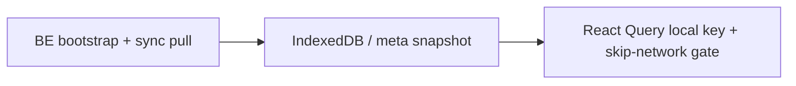

# Offline mode data manifest

**Status:** living document — update whenever bootstrap, sync pull, or local-cache coverage changes.

**Goal:** After the offline sync screen completes (`offlineSyncReady`), every **space-scoped** screen and form in the Fintr app must work without network. If a hook still calls the API on mount, that domain is **not** offline-ready.

This manifest is the checklist. Bootstrap v2 (`GET /spaces/sync/bootstrap` → `bootstrapSpaceV2`) is the primary bulk import; gaps must be closed explicitly — nothing is implied.

---

## Tags and entities in bootstrap v2

Tags and entities are included in bootstrap v2 as of this change:

| Layer | Tags | Entities |
|-------|------|----------|
| `Sync::Operations::BootstrapSpace` payload | ✅ `tags` | ✅ `entities` |
| `bootstrapSpaceV2` tier 0 apply | ✅ | ✅ |
| IndexedDB snapshot | ✅ | ✅ |
| `useSkipCachedNetworkFetch` on hook | ✅ | ✅ |
| Sync pull `SpaceChangeOp` | ❌ pending | ❌ pending |
| Local-first writes | ❌ pending | ❌ pending |

Settings → Tags / Entities should load from cache after sync. Peer changes and offline CRUD still need sync pull + outbox work.

---

## Architecture (three layers)

Every offline-ready domain needs all applicable layers:



| Layer | Responsibility |
|-------|----------------|
| **Bootstrap** | `Sync::Operations::BootstrapSpace` includes payload; `bootstrapSpaceV2` writes IDB + seeds RQ |
| **Incremental sync** | `SpaceChangeOp` in change log; `apply-change.ts` updates IDB + RQ |
| **Reads** | Hook uses `useSkipCachedNetworkFetch` + local cache query; network is write-through only when online |
| **Writes** | `*-local-first.ts` + outbox command (where mutations exist offline) |

**Rule:** Adding a new list/detail API is not enough. If it is not in this manifest with status ✅, offline mode is incomplete.

---

## Bootstrap v2 tiers

`bootstrapSpaceV2` (`apps/fintr-fe/src/services/local-sync/bootstrap-v2.ts`) applies in three tiers:

| Tier | When `offlineSyncReady` | Contents |
|------|-------------------------|----------|
| **0** | User can open app (dashboard shell) | Space context, accounts, categories, current-month transactions slice, monthly summaries + dashboard compose |
| **1** | Full transaction index | All transactions (`2000-01-01` → `2099-12-31`), sync cursor set |
| **2** | Secondary surfaces | Budgets by month, loans + payments, transfer details (per-id fetch), exchange-rate pairs |

Anything **not** in tier 0–2 must be added to bootstrap (or a dedicated prefetch step) **and** documented below.

---

## Space-scoped data inventory

Legend: **Bootstrap** = in `BootstrapSpace` today · **IDB** = persisted locally · **RQ gate** = `useSkipCachedNetworkFetch` · **Pull** = `SpaceChangeOp` · **LF write** = local-first mutation + outbox

### Core money data — required offline

| Domain | API / source | RQ key (typical) | Bootstrap | IDB | RQ gate | Pull | LF write | Status |
|--------|--------------|------------------|-----------|-----|---------|------|----------|--------|
| Space context | bootstrap `space` | `spaceContext` | ✅ | ✅ meta | ✅ | `space.settings.updated` | update | ✅ |
| Spaces list | `GET /spaces` | `spaces` | partial¹ | ✅ meta | ✅ | — | — | ✅ |
| Current user | `GET /auth/private` | `currentUser` | partial¹ | ✅ meta | partial | — | profile update | ✅ |
| Accounts | bootstrap `accounts` | `accounts`, `accounts/local` | ✅ | ✅ | ✅ | via txn sync | create/update² | ✅ |
| Categories | bootstrap `categories` | `transactionCategories` | ✅ | ✅ | ✅ | — | create/update² | ✅ |
| Transactions (index) | bootstrap `transactions` | `transactions` | ✅ | ✅ | ✅ | `transaction.*` | create/update/delete | ✅ |
| Transaction detail | index + `GET /transactions/:id` | `transactionDetail` | partial³ | partial³ | partial | `transaction.updated` | update | ✅ |
| Transfers (detail) | `GET /transactions/transfers/:id` | transfer caches | tier 2 fetch | ✅ | partial | `transaction.*` | create/update/delete | ✅ |
| Monthly financial summaries | bootstrap | `monthlyFinancialSummaries` | ✅ | ✅ | ✅ | via summaries | — | ✅ |
| Dashboard | shell + summaries | `dashboard` | ✅ | ✅ | ✅ | — | — | ✅ |
| Budgets | bootstrap `budgetsByMonth` | `budgets` | ✅ | ✅ | ✅ | — | create/update² | ✅ |
| Loans | bootstrap `loans` | `loans` | ✅ | ✅ | ✅ | `loan.*` | create/update/delete | ✅ |
| Loan payments | embedded in loans + fetch | `loanPayments` | ✅ | ✅ | ✅ | `loan_payment.*` | create/update/delete | ✅ |
| Exchange rates | `GET /exchange_rates/*` | rate keys | tier 2 prefetch | ✅ | ✅ | — | — | ✅ daily refresh on online/focus |

¹ Listed during `bootstrap-local-data` workspace loop, not inside `BootstrapSpace` JSON bundle.

² Account/category/budget **updates** may still require network unless local-first exists for that mutation.

³ Index row is offline; full detail fields may need explicit detail cache.

### Tags & entities — required offline (currently missing)

| Domain | API | RQ key | Bootstrap | IDB | RQ gate | Pull | LF write | Status |
|--------|-----|--------|-----------|-----|---------|------|----------|--------|
| **Transaction tags** | `GET /transactions/tags` | `transactionTags` | ✅ | ✅ | ✅ | ❌ | ❌ | 🟡 bootstrap only |
| **Entities (merchants)** | `GET /entities?entityType=transaction` | `entities`, …, `transaction` | ✅ | ✅ | ✅ | ❌ | ❌ | 🟡 bootstrap only |
| **Entities (loan contacts)** | `GET /entities?entityType=loan` | `entities`, …, `loan` | ✅ | ✅ | ✅ | ❌ | ❌ | 🟡 bootstrap only |
| Entity detail | `GET /entities/:id` | `entityDetail` | ❌ | ❌ | ❌ | ❌ | ❌ | ❌ **gap** |
| Entity identifiers / photos | sub-routes | various | ❌ | ❌ | ❌ | ❌ | ❌ | ❌ **gap** |
| Merchant aliases | TBD | TBD | ❌ | ❌ | ❌ | ❌ | ❌ | ❌ planned PR 7 |

**User impact:** Settings → Tags / Entities and transaction forms (`TransactionEntityField`, `LoanForm`) read from bootstrap cache offline via `fetchEntitiesLocalFirst`.

**Required work (minimum):**

1. Add `tags` and `entities` (both types) to `BootstrapSpace` + `SyncBootstrapResponse`
2. `applyBootstrapTier0` or tier 2: `cacheTagsResponse`, `cacheEntitiesResponse` (new `local-cache.ts` modules)
3. Seed RQ: `["transactionTags", spaceCode]`, `["entities", spaceCode, entityType, ""]`
4. `useTransactionTags` / `useEntities`: local snapshot + `useSkipCachedNetworkFetch`
5. New `SpaceChangeOp`s: `tag.created|updated|deleted`, `entity.created|updated|deleted`
6. Local-first mutations for tag/entity CRUD (or queue + drain)

### Insights & analytics — required offline (mostly client-computed)

| Domain | Source | Status |
|--------|--------|--------|
| Summary / trends | monthly summaries + local txns | ✅ `offline-calculations.ts` |
| Expense breakdown / weekly | local transactions | ✅ |
| Financial health score | summaries + budgets + loans | ✅ |
| Narratives / profiles | local inputs + bundled profiles | ✅ |
| Account breakdown API | `GET /insights/account_breakdown` | 🟡 prefer offline mirror |
| Tag-filtered insights | needs tags in IDB | ❌ blocked on tags |

### Account drill-down — required offline

| Domain | API | Status |
|--------|-----|--------|
| Account detail activities | `GET /transactions/accounts/:id/activities` | ❌ |
| Account balance timeline | account balance timeline endpoint | ❌ |

### Settings & metadata — required offline

| Domain | API | Status |
|--------|-----|--------|
| Space users | space members endpoint | ❌ |
| Gamification / achievements | achievements API | ❌ planned PR 7 |
| Subscriptions (billing) | finance subscriptions | 🟡 optional online-only⁴ |

⁴ Billing may stay online-only by product choice — document explicitly if so.

### Transaction helpers — required offline

| Domain | API | Status |
|--------|-----|--------|
| Note suggestions | `GET /transactions/note_suggestions` | ❌ |
| Transaction drafts | `GET /transactions/drafts` | ❌ |
| CSV export | `GET /transactions/generate_csv` | 🟡 export can require online |

### Import pipeline — online-only (explicit exception)

| Domain | Reason |
|--------|--------|
| Import list / records / upload | Requires server processing; show offline message instead of spinner |

### AI, CRM, admin — online-only (explicit exceptions)

| Domain | Reason |
|--------|--------|
| AI chat / RAG / conversations | Server LLM |
| CRM tickets | Support workflow |
| Admin panels | Staff-only |
| Receipt OCR upload | Server processing |

---

## Sync pull coverage (`SpaceChangeOp`)

Today (`apps/fintr-fe/src/types/syncTypes.ts`):

- `transaction.created|updated|deleted`
- `loan.created|updated|deleted`
- `loan_payment.created|updated|deleted`
- `space.settings.updated`

**Not covered:** tags, entities, categories, accounts, budgets, achievements — peer changes to these will not appear until bootstrap re-run or new ops are added.

---

## IndexedDB stores (today)

`apps/fintr-fe/src/lib/local-db/db.ts` — schema v2:

| Store | Purpose |
|-------|---------|
| `accounts` | Account rows |
| `transactions` | Transaction index |
| `outbox` | Pending local-first commands |
| `meta` | Response snapshots (`putLocalResponseSnapshot`), sync cursor, bootstrap timestamps |

Most caches (categories, budgets, loans, dashboard, rates) use **`meta` response snapshots** via domain `local-cache.ts` modules — not dedicated Dexie tables.

**Planned:** `tags` and `entities` stores or snapshot keys — follow existing `categories/local-cache.ts` pattern unless query volume warrants a table.

---

## Adding a new offline domain (checklist)

Copy this checklist into PR descriptions for offline work:

- [ ] Listed in this manifest with API, RQ keys, and tier
- [ ] `Sync::Operations::BootstrapSpace` returns data (or documented online-only exception)
- [ ] `SyncBootstrapResponse` + `bootstrapSpaceV2` apply step
- [ ] `services/<domain>/local-cache.ts` (read/write IDB)
- [ ] Hook uses local query + `useSkipCachedNetworkFetch`
- [ ] `SpaceChangeOp`(s) + `apply-change.ts` handler (if peers can mutate)
- [ ] `*-local-first.ts` + outbox command (if user can mutate offline)
- [ ] Test: bootstrap seeds data; hook does not network when `offlineSyncReady` + cursor set
- [ ] Update `OFFLINE_SYNC_VERSION` if existing users need re-bootstrap

---

## Verification commands

```bash
# FE offline regression
cd apps/fintr-fe && pnpm test:ci \
  src/services/local-sync/bootstrap-v2.test.ts \
  src/hooks/useOfflineReadMode.test.ts

# BE bootstrap
cd apps/fintr-be && bundle exec rspec spec/operations/sync/operations/bootstrap_space_spec.rb
```

**Manual smoke (after sync screen):** airplane mode → Settings → Tags, Entities, create expense with merchant + tag — no spinners, no failed fetches.

---

## Related docs

- [PR stack](PR-STACK.md) — integration branch and PR slices
- [OFFLINE_INDEXEDDB_SPIKE.md](../../apps/fintr-fe/docs/mobile/OFFLINE_INDEXEDDB_SPIKE.md) — Dexie architecture
- [SPACE_SYNC_CHANGE_LOG.md](../../apps/fintr-fe/docs/mobile/SPACE_SYNC_CHANGE_LOG.md) — sync protocol design
