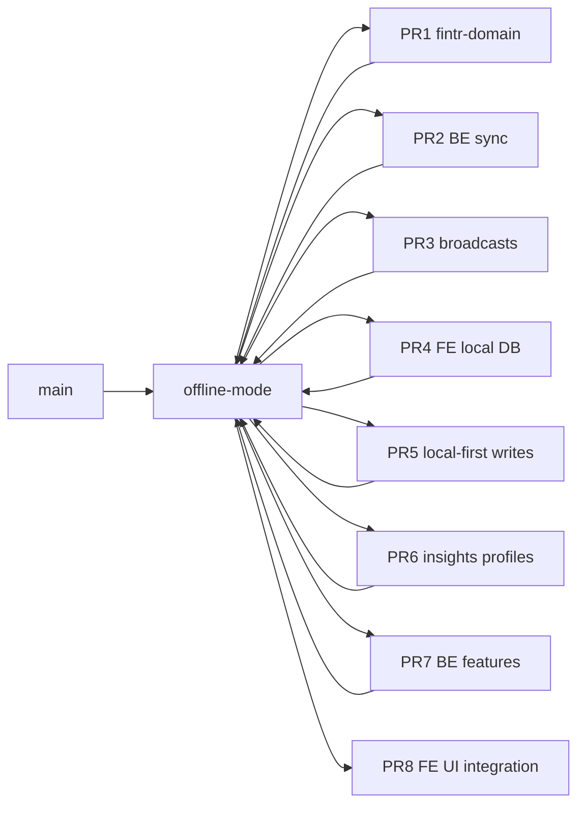

# Offline-mode PR stack

**Integration branch:** `offline-mode` (merge target for every PR below — **not** `main`)

> **Branch naming:** Use `offline-mode-<slice>` (hyphen), not `offline-mode/<slice>` — Git cannot create `offline-mode/foo` while branch `offline-mode` exists.

**Workflow:** Each PR targets `offline-mode`. After merge, pull `offline-mode` locally and branch the next PR from it. `main` stays untouched until the full stack is tested on `offline-mode`.



## First-time remote setup

```bash
# Push integration branch (once)
git push -u origin offline-mode
```

## Open a PR (template)

```bash
git push -u origin offline-mode-<slice-name>
gh pr create \
  --base offline-mode \
  --head offline-mode-<slice-name> \
  --title "<title>" \
  --body "$(cat <<'EOF'
## Summary
- …

## Merge target
`offline-mode` (not `main`)

## Test plan
- [ ] …

EOF
)"
```

---

## PR 1 — `@fintr/domain` shared validation (FIN-197)

**Branch:** `offline-mode-fintr-domain`  
**Depends on:** `offline-mode` @ docs commit only  
**Safe to merge alone:** Yes (additive package + local-first gates)

| Area | Paths |
|------|--------|
| Package | `packages/fintr-domain/**` |
| BE constants + parity | `apps/fintr-be/lib/fintr/domain/**`, `apps/fintr-be/spec/lib/fintr/domain/**` |
| FE wire | `apps/fintr-fe/package.json`, `pnpm-lock.yaml`, `next.config.ts`, `tsconfig.json`, `vitest.config.ts`, `create-local-first.ts`, `transfers/create-local-first.ts` |
| CI | `.github/workflows/ci.yml`, `fintr-fe-ci.yml` |
| Docs / rules / skill | `packages/fintr-domain/README.md`, `.cursor/rules/shared_domain_validation.mdc`, `.ai/rules/shared_domain_validation.mdc`, `.ai/skills/shared-domain-validation/**`, mirrored skill dirs |
| Offline doc link | `apps/fintr-fe/docs/mobile/OFFLINE_INDEXEDDB_SPIKE.md` |

**Tests:** `cd packages/fintr-domain && pnpm test` · `cd apps/fintr-fe && pnpm test:ci src/services/transactions/create-local-first.test.ts` · `bundle exec rspec spec/lib/fintr/domain/contract_parity_spec.rb`

---

## PR 2 — Backend sync foundation (FIN-195 / FIN-196)

**Branch:** `offline-mode-be-sync`  
**Depends on:** PR 1 merged (optional but recommended before client mutation work)

| Area | Paths |
|------|--------|
| Models | `apps/fintr-be/app/models/sync/**`, `apps/fintr-be/app/models/current.rb` |
| Operations | `apps/fintr-be/app/operations/sync/**` |
| API | `apps/fintr-be/app/controllers/api/v1/spaces/sync_controller.rb` |
| DB | `apps/fintr-be/db/migrate/*sync*`, `schema.rb` |
| Jobs | `apps/fintr-be/app/jobs/sync/**` |
| Idempotent creates | `client_mutation_id` in transaction/transfer/loan operations + specs |

**Tests:** sync operation specs, request specs for sync controller

---

## PR 3 — Backend realtime broadcasts

**Branch:** `offline-mode-be-broadcasts`  
**Depends on:** PR 2

| Area | Paths |
|------|--------|
| Channels | `apps/fintr-be/app/channels/transactions_channel.rb`, `spaces_channel.rb`, `transaction_editing/**` |
| Broadcasts | `apps/fintr-be/app/operations/transactions/broadcasts/**`, `spaces/broadcasts/**`, `loans/broadcasts/**` |
| Cable connection | `application_cable/connection.rb` + spec |
| Operation hooks | create/update/delete operations that call broadcasts |

---

## PR 4 — Frontend local DB + sync shell

**Branch:** `offline-mode-fe-local-db`  
**Depends on:** PR 3 (cable shape should match)

| Area | Paths |
|------|--------|
| Dexie | `apps/fintr-fe/src/lib/local-db/**` |
| Bootstrap / drain | `apps/fintr-fe/src/services/local-sync/**` |
| Hooks | `useOfflineSync.ts`, `useTransactionsRealtime.ts` |
| Layout gate | `apps/fintr-fe/src/app/(private)/layout.tsx`, offline sync screen |
| Docs | `apps/fintr-fe/docs/mobile/SPACE_SYNC_CHANGE_LOG.md` |

---

## PR 5 — Frontend local-first writes

**Branch:** `offline-mode-fe-local-first`  
**Depends on:** PR 1 + PR 4

| Area | Paths |
|------|--------|
| Transactions | `create-local-first.ts`, `delete-local-first.ts`, `local-cache.ts`, `upsert-into-query-caches.ts`, … |
| Transfers | `services/transactions/transfers/create-local-first.ts`, fee helpers |
| Loans | `services/loans/create-local-first.ts`, payments local-first |
| Hooks | `useInfiniteTransactions.ts`, `useLoanPayments.ts`, query cache helpers |
| Tests | `*.test.ts` under `services/transactions`, `local-sync` |

---

## PR 6 — Insights customer profiles

**Branch:** `offline-mode-insights-profiles`  
**Depends on:** PR 5 (offline calculations need local cache)

| Area | Paths |
|------|--------|
| BE | `build_customer_profiles.rb`, `create_narratives.rb`, specs |
| FE | `offline-narratives.ts`, `offline-profiles.ts`, `profile-catalog.ts`, `insight-narrative-cards.tsx`, `public/profiles/**` |
| Spec doc | `docs/superpowers/specs/2026-08-10-insights-customer-profiles-design.md` (already on `offline-mode`) |

---

## PR 7 — Backend feature additions (tags, entities, summaries, achievements)

**Branch:** `offline-mode-be-features`  
**Depends on:** PR 2–3

Tags, merchant aliases, monthly financial summaries API, achievements — largely parallel to offline writes but serializers/controllers touch transaction payloads.

**Coverage checklist:** [`DATA_MANIFEST.md`](DATA_MANIFEST.md) — tags and entities are **not** in bootstrap v2 yet; close those rows before marking PR 7 done.

---

## PR 8 — Frontend UI integration (forms, modals, tabs)

**Branch:** `offline-mode-fe-ui`  
**Depends on:** PR 5–7

Large surface: `ExpenseForm`, `TransferForm`, `EditTransactionDialog`, `insights-tab`, `transactions/index`, modals, GridPicker, etc. **Merge last** so the web app reflects the full offline stack.

**Manual test checklist (run on `offline-mode` after PR 8):**

- [ ] Fresh login → offline sync screen completes
- [ ] Create expense offline → appears in list → sync on reconnect
- [ ] Create transfer with fee → optimistic fee row
- [ ] Delete series scope → local + server agree
- [ ] Insights narratives show profile cards when qualified
- [ ] Online peer update via cable updates IDB

---

## Out of scope for this stack

Do **not** include in offline PRs (separate or discard):

- `.ai/skills/impeccable/**`, `.github/skills/impeccable/**`, `.agents/**`
- `DESIGN.md`, `PRODUCT.md` (unless product explicitly wants them)
- `.ruby-lsp/**`, `.claude/settings.local.json`
- `packages/fintr-domain/node_modules/`

---

## Current status (local)

| Branch | State |
|--------|--------|
| `offline-mode` | Integration target; PR stack doc committed; ~500 files still in working tree |
| `offline-mode-fintr-domain` | **PR 1 ready** — FIN-197 `@fintr/domain` |
| `refs/backup/pre-split-offline-mode` | Full dirty-tree snapshot before split |

**Next:** Push `offline-mode`, open PR 1 (`offline-mode-fintr-domain` → `offline-mode`), merge, then slice PR 2+ from updated `offline-mode`.

---

## Recovery

Full un-split snapshot (if created):

```bash
git checkout offline-mode-wip-full   # all offline work, one commit
```

Pre-split backup ref:

```bash
git show refs/backup/pre-split-*
```
